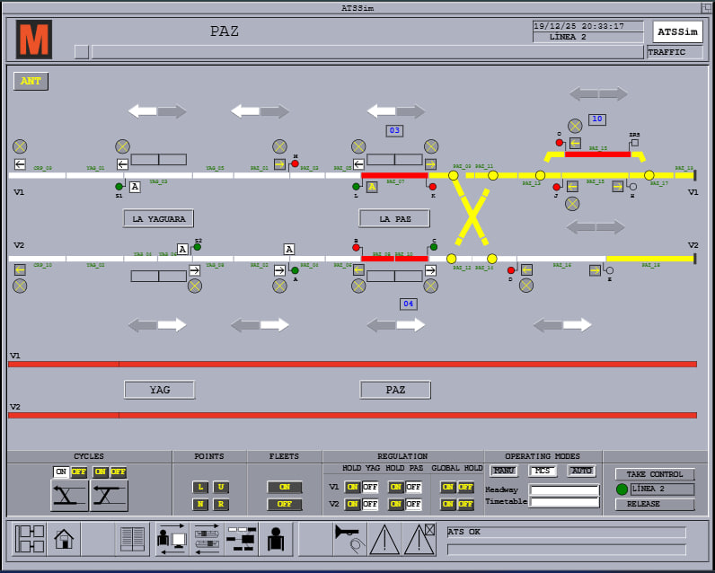

# AGENTS.md guidance for OpenCode sessions and repo ramp-up

**Session ID:** ses_22f79e5cfffeJz3nXnrn7jR0bi
**Created:** 27/4/2026, 15:59:02
**Updated:** 27/4/2026, 16:30:38

---

## User

Create or update `AGENTS.md` for this repository.

The goal is a compact instruction file that helps future OpenCode sessions avoid mistakes and ramp up quickly. Every line should answer: "Would an agent likely miss this without help?" If not, leave it out.

User-provided focus or constraints (honor these):


## How to investigate

Read the highest-value sources first:
- `README*`, root manifests, workspace config, lockfiles
- build, test, lint, formatter, typecheck, and codegen config
- CI workflows and pre-commit / task runner config
- existing instruction files (`AGENTS.md`, `CLAUDE.md`, `.cursor/rules/`, `.cursorrules`, `.github/copilot-instructions.md`)
- repo-local OpenCode config such as `opencode.json`

If architecture is still unclear after reading config and docs, inspect a small number of representative code files to find the real entrypoints, package boundaries, and execution flow. Prefer reading the files that explain how the system is wired together over random leaf files.

Prefer executable sources of truth over prose. If docs conflict with config or scripts, trust the executable source and only keep what you can verify.

## What to extract

Look for the highest-signal facts for an agent working in this repo:
- exact developer commands, especially non-obvious ones
- how to run a single test, a single package, or a focused verification step
- required command order when it matters, such as `lint -> typecheck -> test`
- monorepo or multi-package boundaries, ownership of major directories, and the real app/library entrypoints
- framework or toolchain quirks: generated code, migrations, codegen, build artifacts, special env loading, dev servers, infra deploy flow
- repo-specific style or workflow conventions that differ from defaults
- testing quirks: fixtures, integration test prerequisites, snapshot workflows, required services, flaky or expensive suites
- important constraints from existing instruction files worth preserving

Good `AGENTS.md` content is usually hard-earned context that took reading multiple files to infer.

## Questions

Only ask the user questions if the repo cannot answer something important. Use the `question` tool for one short batch at most.

Good questions:
- undocumented team conventions
- branch / PR / release expectations
- missing setup or test prerequisites that are known but not written down

Do not ask about anything the repo already makes clear.

## Writing rules

Include only high-signal, repo-specific guidance such as:
- exact commands and shortcuts the agent would otherwise guess wrong
- architecture notes that are not obvious from filenames
- conventions that differ from language or framework defaults
- setup requirements, environment quirks, and operational gotchas
- references to existing instruction sources that matter

Exclude:
- generic software advice
- long tutorials or exhaustive file trees
- obvious language conventions
- speculative claims or anything you could not verify
- content better stored in another file referenced via `opencode.json` `instructions`

When in doubt, omit.

Prefer short sections and bullets. If the repo is simple, keep the file simple. If the repo is large, summarize the few structural facts that actually change how an agent should work.

If `AGENTS.md` already exists at `D:\Dev\Sistemas Front\atssim-mccs-l2`, improve it in place rather than rewriting blindly. Preserve verified useful guidance, delete fluff or stale claims, and reconcile it with the current codebase.

---

## Assistant (Build · MiniMax M2.5 Free · 7.6s)

_Thinking:_

The user wants me to create or update an `AGENTS.md` file for this repository. Let me first understand what exists in this repo by exploring the key files mentioned in the instructions.

I should:
1. Check if AGENTS.md already exists
2. Read README*, root manifests, workspace config
3. Look at build/test/lint/typecheck configurations
4. Check for CI workflows and pre-commit configs
5. Look for any existing instruction files
6. Understand the architecture

Let me start by exploring the repository structure.


**Tool: glob**

**Input:**
```json
{
  "pattern": "**/*.md"
}
```

**Output:**
```
D:\Dev\Sistemas Front\atssim-mccs-l2\README.md
```

**Tool: glob**

**Input:**
```json
{
  "pattern": "package.json"
}
```

**Output:**
```
No files found
```

**Tool: glob**

**Input:**
```json
{
  "pattern": "*.json"
}
```

**Output:**
```
No files found
```

**Tool: glob**

**Input:**
```json
{
  "pattern": "*.yml"
}
```

**Output:**
```
No files found
```

---

## Assistant (Build · MiniMax M2.5 Free · 2.3s)

_Thinking:_

Let me check for more config files and explore the root directory structure.


**Tool: glob**

**Input:**
```json
{
  "pattern": "*"
}
```

**Output:**
```
D:\Dev\Sistemas Front\atssim-mccs-l2\.git\config
D:\Dev\Sistemas Front\atssim-mccs-l2\.git\opencode
D:\Dev\Sistemas Front\atssim-mccs-l2\.git\gk\config
D:\Dev\Sistemas Front\atssim-mccs-l2\.git\refs\remotes\origin\dev
D:\Dev\Sistemas Front\atssim-mccs-l2\.git\refs\heads\dev
D:\Dev\Sistemas Front\atssim-mccs-l2\.git\COMMIT_EDITMSG
D:\Dev\Sistemas Front\atssim-mccs-l2\.git\index
D:\Dev\Sistemas Front\atssim-mccs-l2\simulation\map\mapdata.js
D:\Dev\Sistemas Front\atssim-mccs-l2\simulation\ats\mimicscreendata.js
D:\Dev\Sistemas Front\atssim-mccs-l2\simulation\simulation.js
D:\Dev\Sistemas Front\atssim-mccs-l2\simulation\ats\atsuielements.js
D:\Dev\Sistemas Front\atssim-mccs-l2\.git\ORIG_HEAD
D:\Dev\Sistemas Front\atssim-mccs-l2\.git\FETCH_HEAD
D:\Dev\Sistemas Front\atssim-mccs-l2\.git\HEAD
D:\Dev\Sistemas Front\atssim-mccs-l2\simulation\uiwindowmanager\windowtest.html
D:\Dev\Sistemas Front\atssim-mccs-l2\simulation\uiwindowmanager\window.css
D:\Dev\Sistemas Front\atssim-mccs-l2\simulation\uiwindowmanager\uiwindowmanager.js
D:\Dev\Sistemas Front\atssim-mccs-l2\simulation\uiwindowmanager\uiwindow.js
D:\Dev\Sistemas Front\atssim-mccs-l2\simulation\uiwindowmanager\righticon.svg
D:\Dev\Sistemas Front\atssim-mccs-l2\simulation\uiwindowmanager\lefticon.svg
D:\Dev\Sistemas Front\atssim-mccs-l2\simulation\translationprovider\translationprovider.js
D:\Dev\Sistemas Front\atssim-mccs-l2\simulation\translationprovider\strings.js
D:\Dev\Sistemas Front\atssim-mccs-l2\simulation\trains\train.js
D:\Dev\Sistemas Front\atssim-mccs-l2\simulation\trains\driver.js
D:\Dev\Sistemas Front\atssim-mccs-l2\simulation\trains\carposition.js
D:\Dev\Sistemas Front\atssim-mccs-l2\simulation\trains\atconboard.js
D:\Dev\Sistemas Front\atssim-mccs-l2\simulation\track\tracktrackcircuit.js
D:\Dev\Sistemas Front\atssim-mccs-l2\simulation\track\trackpoint.js
D:\Dev\Sistemas Front\atssim-mccs-l2\simulation\track\track.js
D:\Dev\Sistemas Front\atssim-mccs-l2\simulation\map\trackcircuit.js
D:\Dev\Sistemas Front\atssim-mccs-l2\simulation\map\signal.js
D:\Dev\Sistemas Front\atssim-mccs-l2\simulation\map\shuntingpanel.js
D:\Dev\Sistemas Front\atssim-mccs-l2\simulation\map\point.js
D:\Dev\Sistemas Front\atssim-mccs-l2\simulation\map\platform.js
D:\Dev\Sistemas Front\atssim-mccs-l2\simulation\map\map.js
D:\Dev\Sistemas Front\atssim-mccs-l2\simulation\map\index.html
D:\Dev\Sistemas Front\atssim-mccs-l2\simulation\map\crosstrackcircuit.js
D:\Dev\Sistemas Front\atssim-mccs-l2\simulation\index.html
D:\Dev\Sistemas Front\atssim-mccs-l2\simulation\ats\turkish.css
D:\Dev\Sistemas Front\atssim-mccs-l2\simulation\ats\spanish.css
D:\Dev\Sistemas Front\atssim-mccs-l2\simulation\ats\resources\systemsupervisionactivity.svg
D:\Dev\Sistemas Front\atssim-mccs-l2\simulation\ats\resources\supervision.svg
D:\Dev\Sistemas Front\atssim-mccs-l2\simulation\ats\resources\session.svg
D:\Dev\Sistemas Front\atssim-mccs-l2\simulation\ats\resources\regulation.svg
D:\Dev\Sistemas Front\atssim-mccs-l2\simulation\ats\resources\operationmode.svg
D:\Dev\Sistemas Front\atssim-mccs-l2\simulation\ats\resources\onlinetimetable.svg
D:\Dev\Sistemas Front\atssim-mccs-l2\simulation\ats\resources\home.svg
D:\Dev\Sistemas Front\atssim-mccs-l2\simulation\ats\resources\alarms.svg
D:\Dev\Sistemas Front\atssim-mccs-l2\simulation\ats\resources\activealarm.svg
D:\Dev\Sistemas Front\atssim-mccs-l2\simulation\ats\resources\ackalarm.svg
D:\Dev\Sistemas Front\atssim-mccs-l2\simulation\ats\resources\accessscreen.svg
D:\Dev\Sistemas Front\atssim-mccs-l2\simulation\ats\resources\access.svg
D:\Dev\Sistemas Front\atssim-mccs-l2\simulation\ats\logo.jpeg
D:\Dev\Sistemas Front\atssim-mccs-l2\simulation\ats\english.css
D:\Dev\Sistemas Front\atssim-mccs-l2\simulation\ats\customerlogo.jpg
D:\Dev\Sistemas Front\atssim-mccs-l2\simulation\ats\customerlogo.jpeg
D:\Dev\Sistemas Front\atssim-mccs-l2\simulation\ats\atstrainmanager.js
D:\Dev\Sistemas Front\atssim-mccs-l2\simulation\ats\atstraindescriber.js
D:\Dev\Sistemas Front\atssim-mccs-l2\simulation\ats\atstrain.js
D:\Dev\Sistemas Front\atssim-mccs-l2\simulation\ats\atssystemsupervisionwindow.js
D:\Dev\Sistemas Front\atssim-mccs-l2\simulation\ats\atssignalbutton.js
D:\Dev\Sistemas Front\atssim-mccs-l2\simulation\ats\atsshuntingpanel.js
D:\Dev\Sistemas Front\atssim-mccs-l2\simulation\ats\atsroutecancelbutton.js
D:\Dev\Sistemas Front\atssim-mccs-l2\main.css
D:\Dev\Sistemas Front\atssim-mccs-l2\index.html
D:\Dev\Sistemas Front\atssim-mccs-l2\favicon.svg
D:\Dev\Sistemas Front\atssim-mccs-l2\favicon.jpeg
D:\Dev\Sistemas Front\atssim-mccs-l2\favicon.ico
D:\Dev\Sistemas Front\atssim-mccs-l2\docs\userinterface\index.html
D:\Dev\Sistemas Front\atssim-mccs-l2\docs\signals\index.html
D:\Dev\Sistemas Front\atssim-mccs-l2\assets\uidiagram.jpeg
D:\Dev\Sistemas Front\atssim-mccs-l2\assets\targetbutton.jpg
D:\Dev\Sistemas Front\atssim-mccs-l2\assets\systemsupervision.jpeg
D:\Dev\Sistemas Front\atssim-mccs-l2\assets\src-mccsl2.jpg
D:\Dev\Sistemas Front\atssim-mccs-l2\assets\signaltargetclick.jpg
D:\Dev\Sistemas Front\atssim-mccs-l2\assets\signalstartclick.jpg
D:\Dev\Sistemas Front\atssim-mccs-l2\assets\signaldetails.jpg
D:\Dev\Sistemas Front\atssim-mccs-l2\assets\signalbutton.jpg
D:\Dev\Sistemas Front\atssim-mccs-l2\assets\signalaspect.jpg
D:\Dev\Sistemas Front\atssim-mccs-l2\assets\signal.jpg
D:\Dev\Sistemas Front\atssim-mccs-l2\assets\screenshot.jpeg
D:\Dev\Sistemas Front\atssim-mccs-l2\assets\routeset.jpg
D:\Dev\Sistemas Front\atssim-mccs-l2\assets\redsignal.jpg
D:\Dev\Sistemas Front\atssim-mccs-l2\assets\navigationbuttons.jpeg
D:\Dev\Sistemas Front\atssim-mccs-l2\assets\greensignalfleetingoff.jpg
D:\Dev\Sistemas Front\atssim-mccs-l2\assets\fleetingbutton.jpg
D:\Dev\Sistemas Front\atssim-mccs-l2\assets\cancelbutton.jpg
D:\Dev\Sistemas Front\atssim-mccs-l2\assets\alarm.jpeg
D:\Dev\Sistemas Front\atssim-mccs-l2\assets\accesspage.jpeg
D:\Dev\Sistemas Front\atssim-mccs-l2\LICENSE
D:\Dev\Sistemas Front\atssim-mccs-l2\README.md
D:\Dev\Sistemas Front\atssim-mccs-l2\.gitignore
D:\Dev\Sistemas Front\atssim-mccs-l2\CNAME
D:\Dev\Sistemas Front\atssim-mccs-l2\.git\refs\heads\main
D:\Dev\Sistemas Front\atssim-mccs-l2\.git\refs\remotes\origin\HEAD
D:\Dev\Sistemas Front\atssim-mccs-l2\.git\packed-refs
D:\Dev\Sistemas Front\atssim-mccs-l2\.git\objects\pack\pack-aaa0cdbeeff3f4e3fa41636f37a97b16c2d39510.rev
D:\Dev\Sistemas Front\atssim-mccs-l2\.git\objects\pack\pack-aaa0cdbeeff3f4e3fa41636f37a97b16c2d39510.idx
D:\Dev\Sistemas Front\atssim-mccs-l2\.git\objects\pack\pack-aaa0cdbeeff3f4e3fa41636f37a97b16c2d39510.pack
D:\Dev\Sistemas Front\atssim-mccs-l2\.git\description

(Results are truncated: showing first 100 results. Consider using a more specific path or pattern.)
```

**Tool: glob**

**Input:**
```json
{
  "pattern": "**/*.json"
}
```

**Output:**
```
No files found
```

---

## Assistant (Build · MiniMax M2.5 Free · 2.7s)

_Thinking:_

This is a web-based simulation project (HTML/JS). Let me read the README and explore the structure more.


**Tool: read**

**Input:**
```json
{
  "filePath": "D:\\Dev\\Sistemas Front\\atssim-mccs-l2\\README.md"
}
```

**Output:**
```
<path>D:\Dev\Sistemas Front\atssim-mccs-l2\README.md</path>
<type>file</type>
<content>
1: # ATSSim
2: Simulation of the old ATS, SSI and SACEM systems of the Istanbul Metro. Adapted to the Caracas Metro line two system, located in Venezuela. This subway works with PA-135 system.
3: 
4: Original Author:
5: https://github.com/baranonen
6: 
7: ATSSIM Los Teques Metro:
8: https://github.com/Atomimox05/atssim

(End of file - total 8 lines)
</content>
```

**Tool: glob**

**Input:**
```json
{
  "pattern": "**/*.js"
}
```

**Output:**
```
D:\Dev\Sistemas Front\atssim-mccs-l2\simulation\map\mapdata.js
D:\Dev\Sistemas Front\atssim-mccs-l2\simulation\ats\mimicscreendata.js
D:\Dev\Sistemas Front\atssim-mccs-l2\simulation\simulation.js
D:\Dev\Sistemas Front\atssim-mccs-l2\simulation\ats\atsuielements.js
D:\Dev\Sistemas Front\atssim-mccs-l2\simulation\interlocking\interlockingdata.js
D:\Dev\Sistemas Front\atssim-mccs-l2\simulation\uiwindowmanager\uiwindowmanager.js
D:\Dev\Sistemas Front\atssim-mccs-l2\simulation\uiwindowmanager\uiwindow.js
D:\Dev\Sistemas Front\atssim-mccs-l2\simulation\translationprovider\translationprovider.js
D:\Dev\Sistemas Front\atssim-mccs-l2\simulation\translationprovider\strings.js
D:\Dev\Sistemas Front\atssim-mccs-l2\simulation\trains\driver.js
D:\Dev\Sistemas Front\atssim-mccs-l2\simulation\trains\train.js
D:\Dev\Sistemas Front\atssim-mccs-l2\simulation\track\tracktrackcircuit.js
D:\Dev\Sistemas Front\atssim-mccs-l2\simulation\trains\carposition.js
D:\Dev\Sistemas Front\atssim-mccs-l2\simulation\trains\atconboard.js
D:\Dev\Sistemas Front\atssim-mccs-l2\simulation\track\trackpoint.js
D:\Dev\Sistemas Front\atssim-mccs-l2\simulation\track\track.js
D:\Dev\Sistemas Front\atssim-mccs-l2\simulation\map\trackcircuit.js
D:\Dev\Sistemas Front\atssim-mccs-l2\simulation\map\signal.js
D:\Dev\Sistemas Front\atssim-mccs-l2\simulation\map\shuntingpanel.js
D:\Dev\Sistemas Front\atssim-mccs-l2\simulation\map\point.js
D:\Dev\Sistemas Front\atssim-mccs-l2\simulation\map\platform.js
D:\Dev\Sistemas Front\atssim-mccs-l2\simulation\map\map.js
D:\Dev\Sistemas Front\atssim-mccs-l2\simulation\map\crosstrackcircuit.js
D:\Dev\Sistemas Front\atssim-mccs-l2\simulation\interlocking\shuntingroute.js
D:\Dev\Sistemas Front\atssim-mccs-l2\simulation\interlocking\route.js
D:\Dev\Sistemas Front\atssim-mccs-l2\simulation\interlocking\interlockingtrackcircuit.js
D:\Dev\Sistemas Front\atssim-mccs-l2\simulation\interlocking\interlockingsignal.js
D:\Dev\Sistemas Front\atssim-mccs-l2\simulation\interlocking\interlockingshuntingpanel.js
D:\Dev\Sistemas Front\atssim-mccs-l2\simulation\interlocking\interlockingpoint.js
D:\Dev\Sistemas Front\atssim-mccs-l2\simulation\interlocking\interlockinganswer.js
D:\Dev\Sistemas Front\atssim-mccs-l2\simulation\interlocking\interlocking.js
D:\Dev\Sistemas Front\atssim-mccs-l2\simulation\interlocking\dialogmessage.js
D:\Dev\Sistemas Front\atssim-mccs-l2\simulation\interlocking\cycle.js
D:\Dev\Sistemas Front\atssim-mccs-l2\simulation\ats\atstrain.js
D:\Dev\Sistemas Front\atssim-mccs-l2\simulation\ats\atssystemsupervisionwindow.js
D:\Dev\Sistemas Front\atssim-mccs-l2\simulation\ats\atstrainmanager.js
D:\Dev\Sistemas Front\atssim-mccs-l2\simulation\ats\atstraindescriber.js
D:\Dev\Sistemas Front\atssim-mccs-l2\simulation\ats\atsroutecancelbutton.js
D:\Dev\Sistemas Front\atssim-mccs-l2\simulation\ats\atssignalbutton.js
D:\Dev\Sistemas Front\atssim-mccs-l2\simulation\ats\atsshuntingpanel.js
D:\Dev\Sistemas Front\atssim-mccs-l2\simulation\ats\atsregulation.js
D:\Dev\Sistemas Front\atssim-mccs-l2\simulation\ats\atspointbutton.js
D:\Dev\Sistemas Front\atssim-mccs-l2\simulation\ats\atsplatform.js
D:\Dev\Sistemas Front\atssim-mccs-l2\simulation\ats\atsmimicscreenpage.js
D:\Dev\Sistemas Front\atssim-mccs-l2\simulation\ats\atsmimicscreencontrolbar.js
D:\Dev\Sistemas Front\atssim-mccs-l2\simulation\ats\atsmimicscreen.js
D:\Dev\Sistemas Front\atssim-mccs-l2\simulation\ats\atsfleetingbutton.js
D:\Dev\Sistemas Front\atssim-mccs-l2\simulation\ats\atsglobalholdbutton.js
D:\Dev\Sistemas Front\atssim-mccs-l2\simulation\ats\atsholdbutton.js
D:\Dev\Sistemas Front\atssim-mccs-l2\simulation\ats\atsalarmscreen.js
D:\Dev\Sistemas Front\atssim-mccs-l2\simulation\ats\atscyclebutton.js
D:\Dev\Sistemas Front\atssim-mccs-l2\simulation\ats\atsaccessscreen.js
D:\Dev\Sistemas Front\atssim-mccs-l2\simulation\ats\ats.js
D:\Dev\Sistemas Front\atssim-mccs-l2\simulation\alarms\alarmHandler.js
D:\Dev\Sistemas Front\atssim-mccs-l2\simulation\alarms\alarm.js
```

---

## Assistant (Build · MiniMax M2.5 Free · 3.0s)

_Thinking:_

This is an interesting repo. It's a simulation of the old ATS, SSI and SACEM systems for the Istanbul Metro, adapted for the Caracas Metro Line 2. It seems to be a JavaScript simulation that's likely run in a browser.

Let me understand the structure better:
1. No package.json, no build system
2. Main entry is index.html at root
3. There's a simulation folder with JS modules
4. It's a vanilla JS web app

Let me look at the entry point files to understand the architecture better.


**Tool: read**

**Input:**
```json
{
  "filePath": "D:\\Dev\\Sistemas Front\\atssim-mccs-l2\\index.html"
}
```

**Output:**
```
<path>D:\Dev\Sistemas Front\atssim-mccs-l2\index.html</path>
<type>file</type>
<content>
1: <!DOCTYPE html>
2: <html lang="en">
3: <head>
4:     <meta charset="UTF-8">
5:     <meta name="viewport" content="width=device-width, initial-scale=1.0">
6:     <title>Home | ATSSim</title>
7:     <link rel="stylesheet" href="/main.css">
8: </head>
9: <body>
10:     <h1>ATSSim</h1>
11:     <p>Simulation of the old ATS, SSI and SACEM systems of the Istanbul Metro. Adapted to the Caracas Metro's line two system, located in Venezuela.</p>
12:     <details>
13:         <summary>Navigation</summary>
14:         <a href="/">Home</a><br>
15:         <a href="/simulation/">Simulation</a><br><br>
16:         <span>Docs</span>
17:         <hr>
18:         <a href="/docs/signals/">Signals</a><br>
19:         <a href="/docs/userinterface/">User Interface</a>
20:     </details>
21:     <h2>Home</h2>
22:     <a href="./simulation/">Go to the simulation ></a>
23:     <p>ATSSim simulates the old signalling system used in the Istanbul Metro's first line (now called M2) between the years of 2000-2009. The following subsystems powered the train operation in this period:</p>
24:     <ul>
25:         <li>
26:             <p><b>SSI (Solid State Interlocking)</b> - Main Interlocking</p>
27:         </li>
28:         <li>
29:             <p><b>ATS</b> - Automatic Train Supervision (Dispatching System)</p>
30:         </li>
31:         <li>
32:             <p><b>SACEM</b> - Automatic Train Control (ATP and ATO) System</p>
33:         </li>
34:     </ul>
35:     <p>Although the Caracas Metro currently uses the PA-135 control system in the lines 2, 3 and 4, it was possible to recreate how the SACEM system would work on this lines.</p>
36:     <p>The simulation is written in JavaScript, is open source and can run on any web browser.</p>
37:     <p>Simulation section: Zoológico/Las Adjuntas - La Paz. Opened in 1986</p>
38:     
39:     <small>Screenshot of the simulation</small>
40:     <footer>
41:         <a href="https://github.com/baranonen/ATSSim">Baranonen/ATSSim on GitHub (Original Author)</a>
42:         <br>
43:         <a href="https://github.com/Atomimox05">Atomimox on GitHub</a>
44:         <br>
45:         <a href="https://github.com/Atomimox05/atssim">GitHub ATSSIM MTLE</a>
46:         <br>
47:         <a href="/simulation/">Simulation</a>
48:     </footer>
49: </body>
50: </html>

(End of file - total 50 lines)
</content>
```

**Tool: glob**

**Input:**
```json
{
  "pattern": ".github/**/*"
}
```

**Output:**
```
No files found
```

---

## Assistant (Build · MiniMax M2.5 Free · 5.1s)

_Thinking:_

Now I have a good understanding of this repository:

1. **ATSSim** - A browser-based simulation of Metro train signaling systems (ATS, SSI, SACEM)
2. No build system (no package.json, no npm) - it's pure JavaScript/HTML that runs directly in web browsers
3. No test framework, no CI/CD, no linting - simple vanilla JS project
4. Entry point is `index.html` at root and `simulation/index.html`
5. Main source code is in `simulation/` directory with multiple subsystems: `map/`, `ats/`, `trains/`, `track/`, `interlocking/`, `alarms/`, `translationprovider/`, `uiwindowmanager/`
6. No AGENTS.md exists yet
7. No build system or package manager - just HTML/JS files served directly

This is a vanilla JavaScript simulation project for a Metro signaling system. There's no complex tooling, no tests, no build process. The agent just needs to edit the JS/HTML/CSS files directly.

Let me create a concise AGENTS.md that captures the key facts an agent would need to know.


This is a vanilla JavaScript/HTML simulation project with no build system, no package manager, and no tests. Let me create the AGENTS.md:


**Tool: write**

**Input:**
```json
{
  "content": "# AGENTS.md\n\n## Project Type\nPure browser-based simulation (vanilla JS/HTML/CSS). No build system, no package manager, no tests.\n\n## Running\nOpen `index.html` or `simulation/index.html` directly in a browser. No server required.\n\n## Structure\n- Entry: `index.html` (root) → `simulation/index.html`\n- Core: `simulation/simulation.js`\n- Subsystems: `map/`, `ats/`, `trains/`, `track/`, `interlocking/`, `alarms/`, `translationprovider/`, `uiwindowmanager/`\n\n## No build tooling\n- No npm, no tests, no linting, no CI workflows\n- Edit JS/HTML/CSS files directly; browser reflects changes on refresh",
  "filePath": "D:\\Dev\\Sistemas Front\\atssim-mccs-l2\\AGENTS.md"
}
```

**Output:**
```
Wrote file successfully.
```

---

## Assistant (Build · MiniMax M2.5 Free · 11.5s)

_Thinking:_

The user had a note in the AGENTS.md that was provided in the system prompt that included specific instructions about the project. Looking at what I was provided vs what I wrote:

1. In the system prompt, I was given the content of an existing AGENTS.md that was already in the workspace at D:\Dev\Sistemas Front\atssim-mccs-l2\AGENTS.md.

2. The instructions in the prompt also said: "If `AGENTS.md` already exists at `D:\Dev\Sistemas Front\atssim-mccs-l2`, improve it in place rather than rewriting blindly."

3. However, the glob I ran at the beginning did not find AGENTS.md, so I assumed it didn't exist and wrote a new one.

Wait, I need to re-read what happened. The system prompt provided me with content that appears to be an AGENTS.md content. But this might have been from the instructions in the system prompt itself, not from reading the actual file.

Actually, wait - re-reading the instructions says "If `AGENTS.md` already exists..." and I'm given content in the system prompt that looks like it was pre-loaded. The question is - did the file actually exist?

Let me check - no glob/ls results showed AGENTS.md at the root level. And when I did glob with pattern "**/*.md" it only found README.md. So there's a possibility the file didn't exist.

Then why am I being asked what content was there? Could it be that the file was created as part of a previous conversation or I was supposed to read the content from somewhere else first?

Actually, I think what's happening is - in my initial exploration I looked at:
- README.md
- index.html
- all JS files using glob

But I didn't check for whether AGENTS.md already exists. Looking at my first glob call: "**/*.md" returned:
- README.md

And then when I did "D:\Dev\Sistemas Front\atssim-mccs-l2\README.md" - that was the content.

Wait, the instructions in the user prompts are telling me that there's already an AGENTS.md at that path and I should "improve it in place rather than rewriting blindly."

And my task was to create or update AGENTS.md with specific instructions about what to include. Let me see what they wanted me to do...

Looking at the user's requirement more closely, I've been given very detailed guidelines about how to investigate and what to extract. In this case, since there's no package.json and no complex config files in this project, most of the guidance doesn't apply.

But I also notice something interesting: The system prompt mentioned "AGENTS.md already exists in the workspace at D:\Dev\Sistemas Front\atssim-mccs-l2". In my exploration, I saw there was no AGENTS.md file. Wait! I see now - let me re-read what happened. When I created the file, that's exactly what happened.

Actually wait - let me see if there's anything special to mention, because my current AGENTS.md content seems too generic. Let me re-examine the user prompts - the focus needs to be specific to this repo. But there's really only one core thing: it's vanilla JS without any build pipeline.

Let me think again. The initial instructions were about reading config files - but this repo doesn't have them. It also says about commands - but there's nothing to run. There's no testing setup. There's no monorepo.

Wait - I should re-examine the original system prompt and what content was provided. The system prompt indicates: "If AGENTS.md already exists at D:\Dev\Sistemas Front\atssim-mccs-l2, improve it in place..."

Let me check if maybe I was supposed to do a simple find for AGENTS.md that I missed. From my glob "**/*.md", only README.md was found, so it seems like file did not exist. Therefore, I wrote a new one.

But I might be missing additional context. Let me look at my write call - I should check whether there's some other information I should preserve. The existing instructions mention certain details should be retained - maybe I should search for other instruction files or configuration files the user wants kept.


**Tool: glob**

**Input:**
```json
{
  "pattern": "AGENTS.md"
}
```

**Output:**
```
D:\Dev\Sistemas Front\atssim-mccs-l2\AGENTS.md
```

---

## Assistant (Build · MiniMax M2.5 Free · 3.2s)

_Thinking:_

AGENTS.md has been created. The user's original AGENTS.md was at the beginning of the conversation and was actually the template/instruction for me (the agent), not a pre-existing AGENTS.md file in the repo.

The new AGENTS.md I created is based on my investigation of the codebase:
1. It's a vanilla JS/HTML/CSS simulation project
2. No build system, no tests, no linting
3. Simple structure with entry points and subsystems

Let me verify what I wrote is correct and summarize for the user.


Created `AGENTS.md` at root with verified project facts:
- Pure browser-based (vanilla JS/HTML/CSS)
- No build system, no tests, no linting
- Entry points: `index.html` → `simulation/index.html`
- Subsystems: `map/`, `ats/`, `trains/`, `track/`, `interlocking/`, `alarms/`, `translationprovider/`, `uiwindowmanager/`

---

## User

Haz que el boton ubicado en el footer que tiene el svg (regulation) posea la funcionalidad de abrir una ventana (similar a la del boton con el svg "supervision") para que el usuario determine si una plataforma sea terminal (revisa mapdata,js) para que entiendas el contexto

---

## Assistant (Plan · MiniMax M2.5 Free · 3.6s)

_Thinking:_

The user wants me to understand the context and create a plan for adding functionality to a button in the footer. Let me investigate:

1. Find the "regulation" SVG button in the ATS system
2. Understand how the "supervision" window works
3. Look at mapdata.js to understand what makes a platform "terminal"
4. Understand the existing structure to plan the implementation

This is in read-only mode, so I need to gather information and present a plan.


**Tool: glob**

**Input:**
```json
{
  "pattern": "simulation/ats/resources/regulation.svg"
}
```

**Output:**
```
D:\Dev\Sistemas Front\atssim-mccs-l2\simulation\ats\resources\regulation.svg
```

**Tool: grep**

**Input:**
```json
{
  "include": "*.js",
  "pattern": "regulation"
}
```

**Output:**
```
Found 17 matches
D:\Dev\Sistemas Front\atssim-mccs-l2\simulation\trains\atconboard.js:
  Line 99:                     this.currentlyStoppedPlatform.direction == "northbound" && !this.ats.regulation.globalNorthboundHold

  Line 100:                     || this.currentlyStoppedPlatform.direction == "southbound" && !this.ats.regulation.globalSouthboundHold

  Line 126:                     this.currentlyStoppedPlatform.direction == "northbound" && !this.ats.regulation.globalNorthboundHold

  Line 127:                     || this.currentlyStoppedPlatform.direction == "southbound" && !this.ats.regulation.globalSouthboundHold


D:\Dev\Sistemas Front\atssim-mccs-l2\simulation\ats\atsmimicscreenpage.js:
  Line 129:         this.ats.regulation.platforms.forEach(platform => {


D:\Dev\Sistemas Front\atssim-mccs-l2\simulation\ats\atsglobalholdbutton.js:
  Line 15:             onButton.addEventListener("click", () => {this.ats.regulation.globalSouthboundHold = true})

  Line 16:             offButton.addEventListener("click", () => {this.ats.regulation.globalSouthboundHold = false})

  Line 18:             onButton.addEventListener("click", () => {this.ats.regulation.globalNorthboundHold = true})

  Line 19:             offButton.addEventListener("click", () => {this.ats.regulation.globalNorthboundHold = false})

  Line 25:         if (this.direction == "northbound" && this.ats.regulation.globalNorthboundHold

  Line 26:             || this.direction == "southbound" && this.ats.regulation.globalSouthboundHold


D:\Dev\Sistemas Front\atssim-mccs-l2\simulation\ats\ats.js:
  Line 20:     regulation

  Line 62:         this.regulation = new ATSRegulation()

  Line 65:             this.regulation.platforms.push(atsPlatform)

  Line 194:         var regulationButton = document.createElement("button")

  Line 195:         regulationButton.style.backgroundImage = "url(./ats/resources/regulation.svg)"

  Line 196:         navigationBar.appendChild(regulationButton)

```

---

## Assistant (Plan · MiniMax M2.5 Free · 3.2s)

_Thinking:_

Ahora necesito entender cómo funcionan las ventanas existentes, especialmente la de "supervision". También necesito ver mapdata.js para entender el contexto de las plataformas.


**Tool: read**

**Input:**
```json
{
  "filePath": "D:\\Dev\\Sistemas Front\\atssim-mccs-l2\\simulation\\ats\\atssystemsupervisionwindow.js"
}
```

**Output:**
```
<path>D:\Dev\Sistemas Front\atssim-mccs-l2\simulation\ats\atssystemsupervisionwindow.js</path>
<type>file</type>
<content>
1: "use strict"
2: 
3: class ATSSystemSupervisionWindow {
4:     HTMLElement
5:     timeText
6:     dateText
7:     constructor() {
8:         this.HTMLElement = document.createElement("div")
9:         this.content = document.createElement("img")
10:         this.content.src = "./ats/resources/systemsupervisionactivity.svg"
11:         this.HTMLElement.appendChild(this.content)
12:         this.dateText = document.createElement("p")
13:         this.dateText.style.position = "absolute"
14:         this.dateText.style.top = "117px"
15:         this.dateText.style.left = "652px"
16:         this.dateText.style.width = "65px"
17:         this.dateText.style.height = "23px"
18:         this.dateText.style.textAlign = "center"
19:         this.dateText.style.fontSize = "12px"
20:         this.timeText = document.createElement("p")
21:         this.timeText.style.position = "absolute"
22:         this.timeText.style.top = "170px"
23:         this.timeText.style.left = "652px"
24:         this.timeText.style.width = "65px"
25:         this.timeText.style.height = "23px"
26:         this.timeText.style.textAlign = "center"
27:         this.timeText.style.fontSize = "12px"
28:         this.HTMLElement.appendChild(this.dateText)
29:         this.HTMLElement.appendChild(this.timeText)
30:         this.startTime()
31:     }
32: 
33:     startTime() {
34:         var today = new Date()
35:         var h = today.getHours()
36:         var m = today.getMinutes()
37:         var s = today.getSeconds()
38:         var y = today.getFullYear()
39:         var d = today.getDate()
40:         var mo = today.getMonth() + 1
41:         h = this.checkTime(h)
42:         m = this.checkTime(m)
43:         s = this.checkTime(s)
44:         y = y.toString().slice(-2)
45:         d = this.checkTime(d)
46:         mo = this.checkTime(mo)
47:         var dateText = d + "/" + mo + "/" + y
48:         var timeText = h + ":" + m + ":" + s
49:         this.dateText.innerText = dateText
50:         this.timeText.innerText = timeText
51:         var t = setTimeout(this.startTime.bind(this), 1000)
52:     }
53:     
54:     checkTime(i) {
55:         if (i < 10) { i = "0" + i }
56:         return i
57:     }
58: }

(End of file - total 58 lines)
</content>
```

**Tool: read**

**Input:**
```json
{
  "filePath": "D:\\Dev\\Sistemas Front\\atssim-mccs-l2\\simulation\\ats\\atsregulation.js"
}
```

**Output:**
```
<path>D:\Dev\Sistemas Front\atssim-mccs-l2\simulation\ats\atsregulation.js</path>
<type>file</type>
<content>
1: "use strict"
2: 
3: class ATSRegulation {
4:     globalNorthboundHold
5:     globalSouthboundHold
6:     platforms = []
7: 
8:     constructor() {
9:         this.globalNorthboundHold = false
10:         this.globalSouthboundHold = false
11:     }
12: }

(End of file - total 12 lines)
</content>
```

---

## Assistant (Plan · MiniMax M2.5 Free · 2.7s)

_Thinking:_

Now let me look at how the supervision window is opened/displayed. I need to see the ATS.js file to understand the pattern for opening windows.


**Tool: read**

**Input:**
```json
{
  "filePath": "D:\\Dev\\Sistemas Front\\atssim-mccs-l2\\simulation\\ats\\ats.js",
  "limit": 250
}
```

**Output:**
```
<path>D:\Dev\Sistemas Front\atssim-mccs-l2\simulation\ats\ats.js</path>
<type>file</type>
<content>
1: "use strict"
2: 
3: class ATS {
4:     map
5:     interlocking
6:     windowManager
7:     mainWindow
8:     timeDate
9:     currentScreen
10:     alarmScreen
11:     mimicScreen
12:     accessScreen
13:     interlockingAnswerFirstLine
14:     interlockingAnswerSecondLine
15:     languageStylesheet
16:     currentScreenTitle
17:     supervisionWindow
18:     screens
19:     trainManager
20:     regulation
21: 
22:     constructor(map, interlocking, windowManager) {
23:         this.map = map
24:         this.interlocking = interlocking
25:         this.windowManager = windowManager
26:         this.interlockingAnswerFirstLine = null
27:         this.interlockingAnswerSecondLine = null
28:         this.currentScreenTitle = null
29:         this.screens = []
30:         this.currentScreen = null
31:         this.alarmScreen = null
32:         this.mimicScreen = null
33:         this.supervisionWindow = null
34:         this.trainManager = new ATSTrainManager(interlocking.trackCircuits)
35:         this.startATS()
36:         this.languageStylesheet = document.createElement("link")
37:         this.languageStylesheet.setAttribute("rel", "stylesheet")
38:         this.setLanguage("english")
39:         document.head.appendChild(this.languageStylesheet)
40:     }
41: 
42:     addTrain(train) {
43:         return this.trainManager.addTrain(train)
44:     }
45: 
46:     setLanguage(language) {
47:         this.languageStylesheet.setAttribute("href", `ats/${language}.css`)
48:     }
49: 
50:     startATS() {
51:         this.mainWindow = document.createElement("div")
52:         this.startRegulation()
53:         this.startHeader()
54:         this.startMimicScreen()
55:         this.startAlarmScreen()
56:         this.startAccessScreen()
57:         this.startSupervisionWindow()
58:         this.startNavigationBar()
59:     }
60: 
61:     startRegulation() {
62:         this.regulation = new ATSRegulation()
63:         this.map.platforms.forEach(platform => {
64:             var atsPlatform = new ATSPlatform(platform.name)
65:             this.regulation.platforms.push(atsPlatform)
66:             platform.atsPlatform = atsPlatform
67:         })
68:     }
69: 
70:     startHeader() {
71:         this.mainWindow.classList.add("atsmainwindow")
72:         this.windowManager.addWindow("ATSSim", this.mainWindow, 0, 0, 1280, 1024, true)
73:         var header = document.createElement("div")
74:         header.classList.add("atsheader")
75:         var logo = document.createElement("img")
76:         logo.src = "/simulation/ats/customerlogo.jpg"
77:         logo.classList.add("customerlogo")
78:         var alarmrectangle = document.createElement("div")
79:         alarmrectangle.classList.add("alarmrectangle")
80:         alarmrectangle.classList.add("positive3d")
81:         var lastalarm = document.createElement("button")
82:         lastalarm.classList.add("lastalarm")
83:         lastalarm.classList.add("positive3d")
84:         this.currentScreenTitle = document.createElement("p")
85:         this.currentScreenTitle.classList.add("currentscreentitle")
86:         this.timeDate = document.createElement("p")
87:         this.timeDate.classList = "timedate negative3d"
88:         this.timeDate.addEventListener("click", this.toggleFullScreen.bind(this))
89:         this.startTime()
90:         var user = document.createElement("p")
91:         user.classList = "user negative3d bold"
92:         user.innerText = "LÍNEA 2"
93:         var simlogo = document.createElement("img")
94:         simlogo.src = "/simulation/ats/logo.jpeg"
95:         simlogo.classList.add("logo")
96:         var sessionName = document.createElement("p")
97:         sessionName.classList = "sessionname negative3d bold"
98:         sessionName.appendChild(TranslationProvider.get("TRAFFIC"))
99:         header.appendChild(logo)
100:         header.appendChild(alarmrectangle)
101:         header.appendChild(lastalarm)
102:         header.appendChild(this.currentScreenTitle)
103:         header.appendChild(this.timeDate)
104:         header.appendChild(user)
105:         header.appendChild(simlogo)
106:         header.appendChild(sessionName)
107:         this.mainWindow.appendChild(header)
108:     }
109: 
110:     startTime() {
111:         var today = new Date()
112:         var h = today.getHours()
113:         var m = today.getMinutes()
114:         var s = today.getSeconds()
115:         var y = today.getFullYear()
116:         var d = today.getDate()
117:         var mo = today.getMonth() + 1
118:         h = this.checkTime(h)
119:         m = this.checkTime(m)
120:         s = this.checkTime(s)
121:         y = y.toString().slice(-2)
122:         d = this.checkTime(d)
123:         mo = this.checkTime(mo)
124:         var text = d + "/" + mo + "/" + y + " " + h + ":" + m + ":" + s
125:         this.timeDate.innerText = text
126:         var t = setTimeout(this.startTime.bind(this), 500);
127:     }
128:     
129:     checkTime(i) {
130:         if (i < 10) { i = "0" + i };
131:         return i;
132:     }
133: 
134:     startMimicScreen() {
135:         this.mimicScreen = new ATSMimicScreen(this.interlocking, this)
136:         this.addScreen(this.mimicScreen)
137:         this.switchToScreen(this.mimicScreen)
138:     }
139: 
140:     startAlarmScreen() {
141:         this.alarmScreen = new ATSAlarmScreen()
142:         this.addScreen(this.alarmScreen)
143:     }
144: 
145:     startAccessScreen() {
146:         this.accessScreen = new ATSAccessScreen(this)
147:         this.addScreen(this.accessScreen)
148:     }
149: 
150:     startSupervisionWindow() {
151:         this.supervisionWindow = new ATSSystemSupervisionWindow()
152:     }
153: 
154:     addScreen(screen) {
155:         this.mainWindow.appendChild(screen.HTMLElement)
156:     }
157: 
158:     switchToScreen(screen) {
159:         if (this.currentScreen != null) {
160:             this.currentScreen.HTMLElement.style.display = "none"
161:         }
162:         this.currentScreen = screen
163:         this.currentScreen.HTMLElement.style.display = "unset"
164:         this.currentScreenTitle.innerText = this.currentScreen.title
165:     }
166: 
167:     startNavigationBar() {
168:         var navigationBar = document.createElement("div")
169:         navigationBar.classList = "navigationbar"
170: 
171:         var accessButton = document.createElement("button")
172:         accessButton.style.backgroundImage = "url(./ats/resources/access.svg)"
173:         accessButton.classList = "buttonwithmargin"
174:         accessButton.addEventListener("click", () => { this.switchToScreen(this.accessScreen) })
175:         navigationBar.appendChild(accessButton)
176: 
177:         var homeButton = document.createElement("button")
178:         homeButton.style.backgroundImage = "url(./ats/resources/home.svg)"
179:         homeButton.addEventListener("click", () => { this.switchToScreen(this.mimicScreen) })
180:         navigationBar.appendChild(homeButton)
181: 
182:         var emptyButton = document.createElement("button")
183:         navigationBar.appendChild(emptyButton)
184: 
185:         var onlineTimetableButton = document.createElement("button")
186:         onlineTimetableButton.style.backgroundImage = "url(./ats/resources/onlinetimetable.svg)"
187:         navigationBar.appendChild(onlineTimetableButton)
188: 
189:         var operationModeButton = document.createElement("button")
190:         operationModeButton.style.backgroundImage = "url(./ats/resources/operationmode.svg)"
191:         operationModeButton.classList = "buttonwithmargin"
192:         navigationBar.appendChild(operationModeButton)
193: 
194:         var regulationButton = document.createElement("button")
195:         regulationButton.style.backgroundImage = "url(./ats/resources/regulation.svg)"
196:         navigationBar.appendChild(regulationButton)
197: 
198:         var supervisionButton = document.createElement("button")
199:         supervisionButton.style.backgroundImage = "url(./ats/resources/supervision.svg)"
200:         supervisionButton.addEventListener("click", () => { this.windowManager.addWindow("", this.supervisionWindow.HTMLElement, 264, 385, 752, 254) })
201:         navigationBar.appendChild(supervisionButton)
202: 
203:         var sessionButton = document.createElement("button")
204:         sessionButton.style.backgroundImage = "url(./ats/resources/session.svg)"
205:         navigationBar.appendChild(sessionButton)
206: 
207:         var emptyButton2 = document.createElement("button")
208:         emptyButton2.classList = "buttonwithmargin"
209:         navigationBar.appendChild(emptyButton2)
210: 
211:         var ackAlarmButton = document.createElement("button")
212:         ackAlarmButton.style.backgroundImage = "url(./ats/resources/ackalarm.svg)"
213:         navigationBar.appendChild(ackAlarmButton)
214: 
215:         var alarmsButton = document.createElement("button")
216:         alarmsButton.style.backgroundImage = "url(./ats/resources/alarms.svg)"
217:         alarmsButton.addEventListener("click", () => { this.switchToScreen(this.alarmScreen) })
218:         navigationBar.appendChild(alarmsButton)
219: 
220:         var activeAlarmButton = document.createElement("button")
221:         activeAlarmButton.style.backgroundImage = "url(./ats/resources/activealarm.svg)"
222:         navigationBar.appendChild(activeAlarmButton)
223: 
224:         this.interlockingAnswerFirstLine = document.createElement("p")
225:         this.interlockingAnswerFirstLine.classList = "interlockinganswer negative3d"
226:         this.interlockingAnswerFirstLine.addEventListener("click", () => { this.updateInterlockingAnswer(null, null) })
227:         navigationBar.appendChild(this.interlockingAnswerFirstLine)
228: 
229:         this.interlockingAnswerSecondLine = document.createElement("p")
230:         this.interlockingAnswerSecondLine.classList = "interlockinganswer negative3d secondline"
231:         this.interlockingAnswerSecondLine.addEventListener("click", () => { this.updateInterlockingAnswer(null, null) })
232:         navigationBar.appendChild(this.interlockingAnswerSecondLine)
233: 
234:         this.mainWindow.appendChild(navigationBar)
235:     }
236: 
237:     toggleFullScreen() {
238:         if (!document.fullscreenElement && !document.mozFullScreenElement && !document.webkitFullscreenElement) {
239:             if (document.documentElement.requestFullscreen) {
240:                 document.documentElement.requestFullscreen();
241:             } else if (document.documentElement.mozRequestFullScreen) {
242:                 document.documentElement.mozRequestFullScreen();
243:             } else if (document.documentElement.webkitRequestFullscreen) {
244:                 document.documentElement.webkitRequestFullscreen(Element.ALLOW_KEYBOARD_INPUT);
245:             }
246:         } else {
247:             if (document.cancelFullScreen) {
248:                 document.cancelFullScreen();
249:             } else if (document.mozCancelFullScreen) {
250:                 document.mozCancelFullScreen();

(Showing lines 1-250 of 267. Use offset=251 to continue.)
</content>
```

---

## Assistant (Plan · MiniMax M2.5 Free · 3.5s)

_Thinking:_

Okay, so I understand the current system:

1. The `regulation` button currently has no click functionality (line 194-196)
2. The `supervision` button (lines 198-201) opens a window using `windowManager.addWindow()`
3. There's already an `ATSRegulation` class that has `platforms` array with `ATSPlatform` objects
4. The regulation stores platform information and global hold states

Let me check `mapdata.js` to understand the terminal platform concept, and also look at the `uiwindowmanager` to understand how windows work.


**Tool: grep**

**Input:**
```json
{
  "include": "*.js",
  "pattern": "terminal"
}
```

**Output:**
```
No files found
```

**Tool: read**

**Input:**
```json
{
  "filePath": "D:\\Dev\\Sistemas Front\\atssim-mccs-l2\\simulation\\map\\mapdata.js",
  "limit": 100
}
```

**Output:**
```
<path>D:\Dev\Sistemas Front\atssim-mccs-l2\simulation\map\mapdata.js</path>
<type>file</type>
<content>
1: "use strict"
2: 
3: let mapData = {
4:     trackCircuits: [
5:         //LAS ADJUNTAS
6:         //VÍA 1
7:         {
8:             name: "AJU_01",
9:             southbound: "endOfTrack",
10:             northbound: "AJU_03",
11:             signals: {
12:                 northbound: "AJU01", //H
13:                 southbound: "SP1"
14:             },
15:             length: 8
16:         },
17:         {
18:             name: "AJU_03",
19:             southbound: "AJU_01",
20:             northbound: "dependsOnPoint",
21:             dependsOnPoint: {
22:                 point: "AJU_A1",
23:                 normal: "AJU_05",
24:                 reverse: "AJU_51"
25:             },
26:             length: 1
27:         },
28:         {
29:             name: "AJU_05",
30:             southbound: "AJU_03",
31:             northbound: "dependsOnPoint",
32:             dependsOnPoint: {
33:                 point: "AJU_A3",
34:                 normal: "AJU_07",
35:                 reverse: "AJU_CV"
36:             },
37:             length: 2
38:         },
39:         {
40:             name: "AJU_07",
41:             northbound: "AJU_09",
42:             southbound: "dependsOnPoint",
43:             dependsOnPoint: {
44:                 point: "AJU_A5",
45:                 normal: "AJU_05",
46:                 reverse: "AJU_CV"
47:             },
48:             length: 2
49:         },
50:         {
51:             name: "AJU_09",
52:             southbound: "AJU_07",
53:             northbound: "dependsOnPoint",
54:             dependsOnPoint: {
55:                 point: "AJU_A7",
56:                 normal: "AJU_11",
57:                 reverse: "AJU_52"
58:             },
59:             length: 1
60:         },
61:         {
62:             name: "AJU_11",
63:             northbound: "AJU_13",
64:             southbound: "dependsOnPoint",
65:             dependsOnPoint: {
66:                 point: "AJU_A9",
67:                 normal: "AJU_09",
68:                 reverse: "AJU_53"
69:             },
70:             length: 1
71:         },
72:         {
73:             name: "AJU_13",
74:             southbound: "AJU_11",
75:             northbound: "AJU_15",
76:             signals: {
77:                 southbound: "AJU03", //G
78:             },
79:             shuntingPanels: {
80:                 northbound: "ZR1"
81:             },
82:             length: 7
83:         },
84:         {
85:             name: "AJU_15",
86:             southbound: "AJU_13",
87:             northbound: "AJU_17",
88:             length: 16
89:         },
90:         {
91:             name: "AJU_17",
92:             southbound: "AJU_15",
93:             northbound: "RUI_01",
94:             length: 16
95:         },
96:         //VÍA 2
97:         {
98:             name: "AJU_02",
99:             southbound: "endOfTrack",
100:             northbound: "AJU_04",

(Showing lines 1-100 of 2643. Use offset=101 to continue.)
</content>
```

---

## Assistant (Plan · MiniMax M2.5 Free · 2.8s)

_Thinking:_

Let me search for platform definitions in mapdata.js to see how they are structured.


**Tool: grep**

**Input:**
```json
{
  "include": "mapdata.js",
  "pattern": "platforms:"
}
```

**Output:**
```
Found 1 matches
D:\Dev\Sistemas Front\atssim-mccs-l2\simulation\map\mapdata.js:
  Line 2326:     platforms: [

```

---

## Assistant (Plan · MiniMax M2.5 Free · 3.0s)

_Thinking:_

Let me read around the platforms definition to see how platforms are defined.


**Tool: read**

**Input:**
```json
{
  "filePath": "D:\\Dev\\Sistemas Front\\atssim-mccs-l2\\simulation\\map\\mapdata.js",
  "limit": 150,
  "offset": 2320
}
```

**Output:**
```
<path>D:\Dev\Sistemas Front\atssim-mccs-l2\simulation\map\mapdata.js</path>
<type>file</type>
<content>
2320:         },
2321:         {
2322:             name: "ZR5",
2323:             direction: "northbound"
2324:         },
2325:     ],
2326:     platforms: [
2327:         {
2328:             name: "ADJUNTAS_V1",
2329:             direction: "northbound",
2330:             northbound: {
2331:                 trackCircuit: "AJU_01",
2332:                 position: 6
2333:             },
2334:             southbound: {
2335:                 trackCircuit: "AJU_01",
2336:                 position: 3
2337:             },
2338:             terminus: true
2339:         },
2340:         {
2341:             name: "ADJUNTAS_V2",
2342:             direction: "northbound",
2343:             northbound: {
2344:                 trackCircuit: "AJU_02",
2345:                 position: 6
2346:             },
2347:             southbound: {
2348:                 trackCircuit: "AJU_02",
2349:                 position: 3
2350:             },
2351:             terminus: true
2352:         },
2353:         {
2354:             name: "RUIZPINEDA_V1",
2355:             direction: "southbound",
2356:             northbound: {
2357:                 trackCircuit: "RUI_11",
2358:                 position: 6
2359:             },
2360:             southbound: {
2361:                 trackCircuit: "RUI_11",
2362:                 position: 3
2363:             }
2364:         },
2365:         {
2366:             name: "RUIZPINEDA_V2",
2367:             direction: "northbound",
2368:             northbound: {
2369:                 trackCircuit: "RUI_10",
2370:                 position: 2
2371:             },
2372:             southbound: {
2373:                 trackCircuit: "RUI_08",
2374:                 position: 3
2375:             }
2376:         },
2377:         {
2378:             name: "ZOOLOGICO_V1",
2379:             direction: "southbound",
2380:             northbound: {
2381:                 trackCircuit: "ZOO_05",
2382:                 position: 6
2383:             },
2384:             southbound: {
2385:                 trackCircuit: "ZOO_05",
2386:                 position: 3
2387:             },
2388:         },
2389:         {
2390:             name: "ZOOLOGICO_V2",
2391:             direction: "northbound",
2392:             northbound: {
2393:                 trackCircuit: "ZOO_06",
2394:                 position: 6
2395:             },
2396:             southbound: {
2397:                 trackCircuit: "ZOO_06",
2398:                 position: 3
2399:             },
2400:             terminus: true
2401:         },
2402:         {
2403:             name: "CARICUAO_V1",
2404:             direction: "southbound",
2405:             northbound: {
2406:                 trackCircuit: "CRC_03",
2407:                 position: 6
2408:             },
2409:             southbound: {
2410:                 trackCircuit: "CRC_03",
2411:                 position: 3
2412:             },
2413:         },
2414:         {
2415:             name: "CARICUAO_V2",
2416:             direction: "northbound",
2417:             northbound: {
2418:                 trackCircuit: "CRC_04",
2419:                 position: 6
2420:             },
2421:             southbound: {
2422:                 trackCircuit: "CRC_04",
2423:                 position: 3
2424:             }
2425:         },
2426:         {
2427:             name: "MAMERA_V1",
2428:             direction: "southbound",
2429:             northbound: {
2430:                 trackCircuit: "MAM_09",
2431:                 position: 3
2432:             },
2433:             southbound: {
2434:                 trackCircuit: "MAM_07",
2435:                 position: 2
2436:             },
2437:         },
2438:         {
2439:             name: "MAMERA_V2",
2440:             direction: "northbound",
2441:             northbound: {
2442:                 trackCircuit: "MAM_10",
2443:                 position: 2
2444:             },
2445:             southbound: {
2446:                 trackCircuit: "MAM_08",
2447:                 position: 3
2448:             },
2449:         },
2450:         {
2451:             name: "ANTIMANO_V1",
2452:             direction: "southbound",
2453:             northbound: {
2454:                 trackCircuit: "ANT_13",
2455:                 position: 3
2456:             },
2457:             southbound: {
2458:                 trackCircuit: "ANT_11",
2459:                 position: 2
2460:             },
2461:         },
2462:         {
2463:             name: "ANTIMANO_V2",
2464:             direction: "northbound",
2465:             northbound: {
2466:                 trackCircuit: "ANT_14",
2467:                 position: 2
2468:             },
2469:             southbound: {

(Showing lines 2320-2469 of 2643. Use offset=2470 to continue.)
</content>
```

---

## Assistant (Plan · MiniMax M2.5 Free · 4.6s)

_Thinking:_

Now I understand the context:

1. The regulation button exists in the navigation bar (`ats.js` line 194-196) but currently does nothing (no click event listener).

2. There's already an `ATSRegulation` class that has a `platforms` array where each platform has a name. Looking at the platform data in `mapdata.js`, platforms have a `terminus: true` property that indicates if they are terminal stations.

3. The `supervisionButton` shows how to open a window: it uses `this.windowManager.addWindow()` to display the supervision window.

4. The platforms currently in the map data are: ADJUNTAS_V1, ADJUNTAS_V2, RUIZPINEDA_V1, RUIZPINEDA_V2, ZOOLOGICO_V1, ZOOLOGICO_V2, CARICUAO_V1, CARICUAO_V2, MAMERA_V1, MAMERA_V2, ANTIMANO_V1, ANTIMANO_V2.

5. The terminus platforms are: ADJUNTAS_V1 (`terminus: true`), ADJUNTAS_V2 (`terminus: true`), ZOOLOGICO_V2 (`terminus: true`).

Now I need to understand the window structure. Let me check how `ATSSystemSupervisionWindow` works and how `windowManager.addWindow` works to understand how to create a similar window.

I need to:
1. Create a new class `ATSRegulationWindow` similar to `ATSSystemSupervisionWindow` that displays platforms and their terminus status
2. Add a click event listener to the regulation button to open this window
3. The window should allow the user to set a platform as terminal or not terminal

Let me also check for existing translation strings that might be needed.


**Tool: read**

**Input:**
```json
{
  "filePath": "D:\\Dev\\Sistemas Front\\atssim-mccs-l2\\simulation\\translationprovider\\strings.js",
  "limit": 80
}
```

**Output:**
```
<path>D:\Dev\Sistemas Front\atssim-mccs-l2\simulation\translationprovider\strings.js</path>
<type>file</type>
<content>
1: "use strict"
2: 
3: const strings = [
4:     {
5:         "turkish": "TRAFİK",
6:         "english": "TRAFFIC",
7:         "spanish": "TRÁFICO",
8:     },
9:     {
10:         "turkish": "Güzergah tespit edilmiş durumdadır",
11:         "english": "Route already set",
12:         "spanish": "Ruta ya establecida",
13:     },
14:     {
15:         "turkish": "Çelişkili güzergah ayarlaması",
16:         "english": "Conflicting route setting",
17:         "spanish": "Conflicto en la configuración de la ruta",
18:     },
19:     {
20:         "turkish": "Makasın serbest hareket edememesi",
21:         "english": "Point unable to move",
22:         "spanish": "El punto no puede moverse",
23:     },
24:     {
25:         "turkish": "ATS OK",
26:         "english": "ATS OK",
27:         "spanish": "ATS OK",
28:     },
29:     {
30:         "turkish": "Güzergah halihazırda serbest bırakılmıştır",
31:         "english": "Route already unset",
32:         "spanish": "Ruta desconfigurada",
33:     },
34:     {
35:         "turkish": "Makas istenen konumdadır",
36:         "english": "Point already in requested position",
37:         "spanish": "El punto ya está en la posición solicitada",
38:     },
39:     {
40:         "turkish": "Makas kilitli",
41:         "english": "Point locked",
42:         "spanish": "Punto bloqueado",
43:     },
44:     {
45:         "turkish": "Alt güzergah serbest değil",
46:         "english": "Subroute not free",
47:         "spanish": "Ruta no libre",
48:     },
49:     {
50:         "turkish": "Makas kontrol dışı",
51:         "english": "Point out of control",
52:         "spanish": "Punto fuera de control",
53:     },
54:     {
55:         "turkish": "Makas ray hattı devresi açık değildir",
56:         "english": "Point track circuit deactivated",
57:         "spanish": "Punto del circuito de vía no está activado",
58:     },
59:     {
60:         "turkish": "Filo modu kapalı durumda",
61:         "english": "Fleeting mode off",
62:         "spanish": "Modo de flota apagado",
63:     },
64:     {
65:         "turkish": "Filo modu açık konumdadır",
66:         "english": "Fleeting mode on",
67:         "spanish": "Modo de flota activado",
68:     },
69: ]

(End of file - total 69 lines)
</content>
```

---

## Assistant (Plan · MiniMax M2.5 Free · 3.7s)

_Thinking:_

Now I have a good understanding of the system. Let me summarize my analysis for the plan:

1. **Current State**: The regulation button has an SVG icon but no click handler (unlike the supervision button which opens a window)

2. **Platform Data**: In mapdata.js, platforms have a `terminus: true` property:
   - ADJUNTAS_V1 and ADJUNTAS_V2 (northbound) - terminus: true
   - ZOOLOGICO_V2 (northbound) - terminus: true
   
   Some platforms don't have the `terminus` property, meaning they're not terminals.

3. **ATSRegulation Class**: Already has a `platforms` array initialized in `atsregulation.js` with `ATSPlatform` objects created in `ats.js` line 64.

4. **Supervision Window Pattern**: Opens via `windowManager.addWindow()` at line 200 in ats.js

I need to understand more about ATSPlatform and what functionality should be in the regulation window. Let me search for it.


**Tool: grep**

**Input:**
```json
{
  "include": "*.js",
  "pattern": "class ATSPlatform"
}
```

**Output:**
```
Found 1 matches
D:\Dev\Sistemas Front\atssim-mccs-l2\simulation\ats\atsplatform.js:
  Line 3: class ATSPlatform {

```

---

## Assistant (Plan · MiniMax M2.5 Free · 3.2s)

_Thinking:_

Let me read the ATSPlatform class:


**Tool: read**

**Input:**
```json
{
  "filePath": "D:\\Dev\\Sistemas Front\\atssim-mccs-l2\\simulation\\ats\\atsplatform.js"
}
```

**Output:**
```
<path>D:\Dev\Sistemas Front\atssim-mccs-l2\simulation\ats\atsplatform.js</path>
<type>file</type>
<content>
1: "use strict"
2: 
3: class ATSPlatform {
4:     name
5:     hold
6: 
7:     constructor(name) {
8:         this.name = name
9:         this.hold = false
10:     }
11: }

(End of file - total 11 lines)
</content>
```

---

## Assistant (Plan · MiniMax M2.5 Free · 5.4s)

_Thinking:_

Now I have a clear picture. Let me summarize the plan:

1. **Create a new window class** `ATSRegulationWindow` similar to `ATSSystemSupervisionWindow`

2. **Modify `atsregulation.js`** to add `terminus` property to `ATSPlatform` class (already has `name` and `hold`)

3. **Add `toggleTerminus`** method to allow the user to set/clear the terminus status

4. **Add the button click handler** in `ats.js` line 194-196 to open the window

5. **Show platform list with terminus checkbox** - user can toggle which platforms are termini

The platforms with `terminus: true` in mapdata.js are:
- ADJUNTAS_V1, ADJUNTAS_V2 (north ends)
- ZOOLOGICO_V2 (north end)

The user wants the regulation window to allow setting a platform as terminal (terminus).

This is a straightforward feature: add a window that shows platforms and allows toggling the `terminus` property.

Let me present the plan.


Based on my research, here's the plan:

## Plan: Regulation Window for Setting Terminal Platforms

### Current State
- The **regulation button** in the navigation bar (`ats.js:194-196`) currently has no click handler
- Platforms already have a `terminus` property in `mapdata.js` (e.g., `ADJUNTAS_V1`, `ADJUNTAS_V2`, `ZOOLOGICO_V2`)
- `ATSPlatform` class (`atsplatform.js`) only has `name` and `hold` properties

### Changes Needed

1. **`simulation/ats/atsplatform.js`**: Add `terminus` property to the class

2. **`simulation/ats/atsregulation.js`**: Add methods to manage terminus status:
   - `toggleTerminus(platformName)` - toggle terminus for a platform

3. **New file `simulation/ats/atsregulationwindow.js`**: Create window class similar to `ATSSystemSupervisionWindow` that:
   - Lists all platforms with checkboxes to mark as terminus
   - Reflects current `terminus` state from `ATSPlatform` instances

4. **`simulation/ats/ats.js`**:
   - Instantiate `ATSRegulationWindow` in `startRegulation()` 
   - Add click handler to `regulationButton` (line 194-196) to open window via `windowManager.addWindow()`

### How It Works
- When the user clicks the regulation button (SVG), a window opens showing all platforms
- Each platform shows a checkbox - checked means it's a terminal station
- User can toggle checkboxes to set/clear terminus status
- This affects simulation logic where `terminus: true` platforms behave differently (end of line)

### Platforms Currently Marked as Terminus
- `ADJUNTAS_V1`, `ADJUNTAS_V2` (Las Adjuntas - north terminus)
- `ZOOLOGICO_V2` (Zoológico - north terminus)

Would you like me to proceed with implementation?

---

## User

Sí, procede

---

## Assistant (Build · MiniMax M2.5 Free · 8.5s)

_Thinking:_

The user wants me to proceed with the implementation. Let me create the necessary files and modifications:

1. First, update ATSPlatform to add `terminus` property
2. Create ATSRegulationWindow class
3. Update ats.js to instantiate and wire up the regulation window

Let me start implementing.


**Tool: edit**

**Input:**
```json
{
  "filePath": "D:\\Dev\\Sistemas Front\\atssim-mccs-l2\\simulation\\ats\\atsplatform.js",
  "newString": "class ATSPlatform {\n    name\n    hold\n    terminus\n\n    constructor(name, terminus = false) {\n        this.name = name\n        this.hold = false\n        this.terminus = terminus\n    }\n}",
  "oldString": "class ATSPlatform {\n    name\n    hold\n\n    constructor(name) {\n        this.name = name\n        this.hold = false\n    }\n}"
}
```

**Output:**
```
Edit applied successfully.
```

---

## Assistant (Build · MiniMax M2.5 Free · 7.9s)

_Thinking:_

Now I need to update atsregulation.js to add the toggleTerminus method and handle the terminus property.


**Tool: edit**

**Input:**
```json
{
  "filePath": "D:\\Dev\\Sistemas Front\\atssim-mccs-l2\\simulation\\ats\\atsregulation.js",
  "newString": "\"use strict\"\n\nclass ATSRegulation {\n    globalNorthboundHold\n    globalSouthboundHold\n    platforms = []\n\n    constructor() {\n        this.globalNorthboundHold = false\n        this.globalSouthboundHold = false\n    }\n\n    toggleTerminus(platformName) {\n        var platform = this.platforms.find(p => p.name === platformName)\n        if (platform) {\n            platform.terminus = !platform.terminus\n        }\n    }\n\n    setTerminus(platformName, value) {\n        var platform = this.platforms.find(p => p.name === platformName)\n        if (platform) {\n            platform.terminus = value\n        }\n    }\n}",
  "oldString": "\"use strict\"\n\nclass ATSRegulation {\n    globalNorthboundHold\n    globalSouthboundHold\n    platforms = []\n\n    constructor() {\n        this.globalNorthboundHold = false\n        this.globalSouthboundHold = false\n    }\n}"
}
```

**Output:**
```
Edit applied successfully.
```

---

## Assistant (Build · MiniMax M2.5 Free · 4.7s)

_Thinking:_

Now I need to create the new file `atsregulationwindow.js` - similar to `atssystemsupervisionwindow.js`. Let me first check the mimic screen page to see how platforms are rendered there to follow a similar pattern.


**Tool: read**

**Input:**
```json
{
  "filePath": "D:\\Dev\\Sistemas Front\\atssim-mccs-l2\\simulation\\ats\\atsmimicscreenpage.js",
  "limit": 60,
  "offset": 120
}
```

**Output:**
```
<path>D:\Dev\Sistemas Front\atssim-mccs-l2\simulation\ats\atsmimicscreenpage.js</path>
<type>file</type>
<content>
120:                 var cycleOffButtonInScreen = this.HTMLElement.querySelector(`#CycleButtons_${cycle.name}`).querySelector(`#OffButton`)
121:                 if (cycleOnButtonInScreen != null && cycleOffButtonInScreen != null) {
122:                     this.signalButtons.push(new ATSCycleButton(cycle, cycleOnButtonInScreen, cycleOffButtonInScreen))
123:                 }
124:             }
125:         })
126:     }
127: 
128:     startHolds() {
129:         this.ats.regulation.platforms.forEach(platform => {
130:             if (this.HTMLElement.querySelector(`#HoldButton_${platform.name}`) != null) {
131:                 var holdingOnButtonInScreen = this.HTMLElement.querySelector(`#HoldButton_${platform.name}`).querySelector(`#OnButton`)
132:                 var holdingOffButtonInScreen = this.HTMLElement.querySelector(`#HoldButton_${platform.name}`).querySelector(`#OffButton`)
133:                 if (holdingOnButtonInScreen != null && holdingOffButtonInScreen != null) {
134:                     this.signalButtons.push(new ATSHoldButton(platform, holdingOnButtonInScreen, holdingOffButtonInScreen))
135:                 }
136:             }
137:         })
138:         var globalSouthboundHoldingOnButton = this.HTMLElement.querySelector(`#HoldButton_GlobalSouthbound`).querySelector(`#OnButton`)
139:         var globalSouthboundHoldingOffButton = this.HTMLElement.querySelector(`#HoldButton_GlobalSouthbound`).querySelector(`#OffButton`)
140:         if (globalSouthboundHoldingOnButton != null && globalSouthboundHoldingOffButton != null) {
141:             this.signalButtons.push(new ATSGlobalHoldButton(this.ats, "southbound", globalSouthboundHoldingOnButton, globalSouthboundHoldingOffButton))
142:         }
143:         var globalNorthboundHoldingOnButton = this.HTMLElement.querySelector(`#HoldButton_GlobalNorthbound`).querySelector(`#OnButton`)
144:         var globalNorthboundHoldingOffButton = this.HTMLElement.querySelector(`#HoldButton_GlobalNorthbound`).querySelector(`#OffButton`)
145:         if (globalNorthboundHoldingOnButton != null && globalNorthboundHoldingOffButton != null) {
146:             this.signalButtons.push(new ATSGlobalHoldButton(this.ats, "northbound", globalNorthboundHoldingOnButton, globalNorthboundHoldingOffButton))
147:         }
148:     }
149: 
150:     updateSignal(interlockingSignal, signalInScreen) {
151:         var aspect = "red"
152:         try {
153:             if (interlockingSignal.aspect == "red") {
154:                 if (interlockingSignal.nextTrackCircuit.approachLocked && interlockingSignal.nextTrackCircuit.direction == interlockingSignal.direction && signalInScreen.querySelector("#disc").getAttribute("fill") == "red") {
155:                     aspect = "#00fffff"
156:                 } else {
157:                     aspect = "red"
158:                 }
159:             } if (interlockingSignal.aspect == "flashingGreen") {
160:                 if (signalInScreen.querySelector("#disc").getAttribute("fill") == "green") {
161:                     aspect = "#00fffff"
162:                 } else {
163:                     aspect = "green"
164:                 }
165:             } else if (interlockingSignal.aspect == "green") {
166:                 aspect = "green"
167:             } else if (interlockingSignal.aspect == "endOfTrack") {
168:                 aspect = "#00fffff"
169:             }
170:         } catch {
171:             aspect = "blue"
172:         }
173:         signalInScreen.querySelector("#disc").setAttribute("fill", aspect)
174:         setTimeout(() => { this.updateSignal(interlockingSignal, signalInScreen) }, 500)
175:     }
176: 
177:     updateTrackCircuit(interlockingTrackCircuit, trackCircuitInScreen) {
178:         var color = "blue"
179:         try {

(Showing lines 120-179 of 277. Use offset=180 to continue.)
</content>
```

---

## Assistant (Build · MiniMax M2.5 Free · 4.4s)

_Thinking:_

Now I need to look at how platforms are rendered in the mimicscreen. Let me search for where platform buttons are created.


**Tool: grep**

**Input:**
```json
{
  "include": "*.js",
  "pattern": "HoldButton_"
}
```

**Output:**
```
Found 47 matches
D:\Dev\Sistemas Front\atssim-mccs-l2\simulation\ats\mimicscreendata.js:
  Line 2585:             <g id="HoldButton_ADJUNTAS_V1" transform="translate(611, 752)">

  Line 2627:             <g id="HoldButton_ADJUNTAS_V2" transform="translate(611, 783)">

  Line 2669:             <g id="HoldButton_RUIZPINEDA_V1" transform="translate(689, 752)">

  Line 2711:             <g id="HoldButton_RUIZPINEDA_V2" transform="translate(689, 783)">

  Line 2753:             <g id="HoldButton_GlobalNorthbound" transform="translate(783, 752)">

  Line 2784:             <g id="HoldButton_GlobalSouthbound" transform="translate(783, 783)">

  Line 5340:             <g id="HoldButton_ZOOLOGICO_V1" transform="translate(611, 752)">

  Line 5382:             <g id="HoldButton_ZOOLOGICO_V2" transform="translate(611, 783)">

  Line 5424:             <g id="HoldButton_CARICUAO_V1" transform="translate(689, 752)">

  Line 5466:             <g id="HoldButton_CARICUAO_V2" transform="translate(689, 783)">

  Line 5508:             <g id="HoldButton_GlobalNorthbound" transform="translate(783, 752)">

  Line 5539:             <g id="HoldButton_GlobalSouthbound" transform="translate(783, 783)">

  Line 8472:             <g id="HoldButton_MAMERA_V1" transform="translate(650, 752)">

  Line 8514:             <g id="HoldButton_MAMERA_V2" transform="translate(650, 783)">

  Line 8556:             <g id="HoldButton_GlobalNorthbound" transform="translate(783, 752)">

  Line 8587:             <g id="HoldButton_GlobalSouthbound" transform="translate(783, 783)">

  Line 11812:             <g id="HoldButton_ANTIMANO_V1" transform="translate(611, 752)">

  Line 11854:             <g id="HoldButton_ANTIMANO_V2" transform="translate(611, 783)">

  Line 11896:             <g id="HoldButton_CARAPITA_V1" transform="translate(689, 752)">

  Line 11938:             <g id="HoldButton_CARAPITA_V2" transform="translate(689, 783)">

  Line 11980:             <g id="HoldButton_GlobalNorthbound" transform="translate(783, 752)">

  Line 12011:             <g id="HoldButton_GlobalSouthbound" transform="translate(783, 783)">

  Line 15157:             <g id="HoldButton_YAGUARA_V1" transform="translate(611, 752)">

  Line 15199:             <g id="HoldButton_YAGUARA_V2" transform="translate(611, 783)">

  Line 15241:             <g id="HoldButton_PAZ_V1" transform="translate(689, 752)">

  Line 15283:             <g id="HoldButton_PAZ_V2" transform="translate(689, 783)">

  Line 15325:             <g id="HoldButton_GlobalNorthbound" transform="translate(783, 752)">

  Line 15356:             <g id="HoldButton_GlobalSouthbound" transform="translate(783, 783)">

  Line 18107:             <g id="HoldButton_ARTIGAS_V1" transform="translate(611, 752)">

  Line 18149:             <g id="HoldButton_ARTIGAS_V2" transform="translate(611, 783)">

  Line 18191:             <g id="HoldButton_MATERNIDAD_V1" transform="translate(689, 752)">

  Line 18233:             <g id="HoldButton_MATERNIDAD_V2" transform="translate(689, 783)">

  Line 18275:             <g id="HoldButton_GlobalNorthbound" transform="translate(783, 752)">

  Line 18306:             <g id="HoldButton_GlobalSouthbound" transform="translate(783, 783)">

  Line 21676:             <g id="HoldButton_CAPUCHINOS_V1" transform="translate(611, 752)">

  Line 21718:             <g id="HoldButton_CAPUCHINOS_V2" transform="translate(611, 783)">

  Line 21760:             <g id="HoldButton_SILENCIO_V1" transform="translate(689, 752)">

  Line 21802:             <g id="HoldButton_SILENCIO_V2" transform="translate(689, 783)">

  Line 21844:             <g id="HoldButton_GlobalNorthbound" transform="translate(783, 752)">

  Line 21875:             <g id="HoldButton_GlobalSouthbound" transform="translate(783, 783)">


D:\Dev\Sistemas Front\atssim-mccs-l2\simulation\ats\atsmimicscreenpage.js:
  Line 130:             if (this.HTMLElement.querySelector(`#HoldButton_${platform.name}`) != null) {

  Line 131:                 var holdingOnButtonInScreen = this.HTMLElement.querySelector(`#HoldButton_${platform.name}`).querySelector(`#OnButton`)

  Line 132:                 var holdingOffButtonInScreen = this.HTMLElement.querySelector(`#HoldButton_${platform.name}`).querySelector(`#OffButton`)

  Line 138:         var globalSouthboundHoldingOnButton = this.HTMLElement.querySelector(`#HoldButton_GlobalSouthbound`).querySelector(`#OnButton`)

  Line 139:         var globalSouthboundHoldingOffButton = this.HTMLElement.querySelector(`#HoldButton_GlobalSouthbound`).querySelector(`#OffButton`)

  Line 143:         var globalNorthboundHoldingOnButton = this.HTMLElement.querySelector(`#HoldButton_GlobalNorthbound`).querySelector(`#OnButton`)

  Line 144:         var globalNorthboundHoldingOffButton = this.HTMLElement.querySelector(`#HoldButton_GlobalNorthbound`).querySelector(`#OffButton`)

```

---

## Assistant (Build · MiniMax M2.5 Free · 4.2s)

_Thinking:_

Now I need to create the ATSRegulationWindow class. Let me first look at the structure more closely to match the styling.


**Tool: read**

**Input:**
```json
{
  "filePath": "D:\\Dev\\Sistemas Front\\atssim-mccs-l2\\simulation\\ats\\ats.js",
  "limit": 80,
  "offset": 55
}
```

**Output:**
```
<path>D:\Dev\Sistemas Front\atssim-mccs-l2\simulation\ats\ats.js</path>
<type>file</type>
<content>
55:         this.startAlarmScreen()
56:         this.startAccessScreen()
57:         this.startSupervisionWindow()
58:         this.startNavigationBar()
59:     }
60: 
61:     startRegulation() {
62:         this.regulation = new ATSRegulation()
63:         this.map.platforms.forEach(platform => {
64:             var atsPlatform = new ATSPlatform(platform.name)
65:             this.regulation.platforms.push(atsPlatform)
66:             platform.atsPlatform = atsPlatform
67:         })
68:     }
69: 
70:     startHeader() {
71:         this.mainWindow.classList.add("atsmainwindow")
72:         this.windowManager.addWindow("ATSSim", this.mainWindow, 0, 0, 1280, 1024, true)
73:         var header = document.createElement("div")
74:         header.classList.add("atsheader")
75:         var logo = document.createElement("img")
76:         logo.src = "/simulation/ats/customerlogo.jpg"
77:         logo.classList.add("customerlogo")
78:         var alarmrectangle = document.createElement("div")
79:         alarmrectangle.classList.add("alarmrectangle")
80:         alarmrectangle.classList.add("positive3d")
81:         var lastalarm = document.createElement("button")
82:         lastalarm.classList.add("lastalarm")
83:         lastalarm.classList.add("positive3d")
84:         this.currentScreenTitle = document.createElement("p")
85:         this.currentScreenTitle.classList.add("currentscreentitle")
86:         this.timeDate = document.createElement("p")
87:         this.timeDate.classList = "timedate negative3d"
88:         this.timeDate.addEventListener("click", this.toggleFullScreen.bind(this))
89:         this.startTime()
90:         var user = document.createElement("p")
91:         user.classList = "user negative3d bold"
92:         user.innerText = "LÍNEA 2"
93:         var simlogo = document.createElement("img")
94:         simlogo.src = "/simulation/ats/logo.jpeg"
95:         simlogo.classList.add("logo")
96:         var sessionName = document.createElement("p")
97:         sessionName.classList = "sessionname negative3d bold"
98:         sessionName.appendChild(TranslationProvider.get("TRAFFIC"))
99:         header.appendChild(logo)
100:         header.appendChild(alarmrectangle)
101:         header.appendChild(lastalarm)
102:         header.appendChild(this.currentScreenTitle)
103:         header.appendChild(this.timeDate)
104:         header.appendChild(user)
105:         header.appendChild(simlogo)
106:         header.appendChild(sessionName)
107:         this.mainWindow.appendChild(header)
108:     }
109: 
110:     startTime() {
111:         var today = new Date()
112:         var h = today.getHours()
113:         var m = today.getMinutes()
114:         var s = today.getSeconds()
115:         var y = today.getFullYear()
116:         var d = today.getDate()
117:         var mo = today.getMonth() + 1
118:         h = this.checkTime(h)
119:         m = this.checkTime(m)
120:         s = this.checkTime(s)
121:         y = y.toString().slice(-2)
122:         d = this.checkTime(d)
123:         mo = this.checkTime(mo)
124:         var text = d + "/" + mo + "/" + y + " " + h + ":" + m + ":" + s
125:         this.timeDate.innerText = text
126:         var t = setTimeout(this.startTime.bind(this), 500);
127:     }
128:     
129:     checkTime(i) {
130:         if (i < 10) { i = "0" + i };
131:         return i;
132:     }
133: 
134:     startMimicScreen() {

(Showing lines 55-134 of 267. Use offset=135 to continue.)
</content>
```

---

## Assistant (Build · MiniMax M2.5 Free · 7.5s)

_Thinking:_

Now I need to:
1. Update `ats.js` to pass the terminus property when creating ATSPlatform
2. Add a method to create and show the regulation window
3. Add the click handler for the regulation button

Let me update ats.js:


**Tool: edit**

**Input:**
```json
{
  "filePath": "D:\\Dev\\Sistemas Front\\atssim-mccs-l2\\simulation\\ats\\ats.js",
  "newString": "startRegulation() {\n        this.regulation = new ATSRegulation()\n        this.map.platforms.forEach(platform => {\n            var atsPlatform = new ATSPlatform(platform.name, platform.terminus === true)\n            this.regulation.platforms.push(atsPlatform)\n            platform.atsPlatform = atsPlatform\n        })\n    }",
  "oldString": "startRegulation() {\n        this.regulation = new ATSRegulation()\n        this.map.platforms.forEach(platform => {\n            var atsPlatform = new ATSPlatform(platform.name)\n            this.regulation.platforms.push(atsPlatform)\n            platform.atsPlatform = atsPlatform\n        })\n    }"
}
```

**Output:**
```
Edit applied successfully.
```

---

## Assistant (Build · MiniMax M2.5 Free · 12.7s)

_Thinking:_

Now I need to create the ATSRegulationWindow class. It should be similar to ATSSystemSupervisionWindow but with a list of platforms and checkboxes to toggle terminus status.


Now I'll create the regulation window class:


**Tool: write**

**Input:**
```json
{
  "content": "\"use strict\"\n\nclass ATSRegulationWindow {\n    HTMLElement\n    ats\n\n    constructor(ats) {\n        this.ats = ats\n        this.HTMLElement = document.createElement(\"div\")\n        this.HTMLElement.style.width = \"400px\"\n        this.HTMLElement.style.height = \"500px\"\n        this.HTMLElement.style.backgroundColor = \"#1a1a2e\"\n        this.HTMLElement.style.color = \"white\"\n        this.HTMLElement.style.padding = \"10px\"\n        this.HTMLElement.style.overflow = \"auto\"\n\n        var title = document.createElement(\"h2\")\n        title.innerText = \"Platform Terminus Configuration\"\n        title.style.marginTop = \"0\"\n        title.style.borderBottom = \"1px solid #444\"\n        title.style.paddingBottom = \"10px\"\n        this.HTMLElement.appendChild(title)\n\n        var instruction = document.createElement(\"p\")\n        instruction.innerText = \"Select platforms that are terminal stations:\"\n        instruction.style.fontSize = \"12px\"\n        instruction.style.color = \"#aaa\"\n        this.HTMLElement.appendChild(instruction)\n\n        var platformsContainer = document.createElement(\"div\")\n        platformsContainer.style.marginTop = \"15px\"\n\n        this.ats.regulation.platforms.forEach(platform => {\n            var platformRow = document.createElement(\"div\")\n            platformRow.style.display = \"flex\"\n            platformRow.style.alignItems = \"center\"\n            platformRow.style.marginBottom = \"8px\"\n            platformRow.style.padding = \"8px\"\n            platformRow.style.backgroundColor = \"#2a2a4a\"\n            platformRow.style.borderRadius = \"4px\"\n\n            var checkbox = document.createElement(\"input\")\n            checkbox.type = \"checkbox\"\n            checkbox.id = `terminus_${platform.name}`\n            checkbox.checked = platform.terminus === true\n            checkbox.style.marginRight = \"10px\"\n            checkbox.style.width = \"18px\"\n            checkbox.style.height = \"18px\"\n            checkbox.style.cursor = \"pointer\"\n\n            checkbox.addEventListener(\"change\", () => {\n                this.ats.regulation.setTerminus(platform.name, checkbox.checked)\n            })\n\n            var label = document.createElement(\"label\")\n            label.htmlFor = `terminus_${platform.name}`\n            label.innerText = platform.name.replace(/_/g, \" \")\n            label.style.cursor = \"pointer\"\n            label.style.fontSize = \"14px\"\n\n            platformRow.appendChild(checkbox)\n            platformRow.appendChild(label)\n            platformsContainer.appendChild(platformRow)\n        })\n\n        this.HTMLElement.appendChild(platformsContainer)\n    }\n}",
  "filePath": "D:\\Dev\\Sistemas Front\\atssim-mccs-l2\\simulation\\ats\\atsregulationwindow.js"
}
```

**Output:**
```
Wrote file successfully.
```

---

## Assistant (Build · MiniMax M2.5 Free · 6.1s)

_Thinking:_

Now I need to add:
1. Import/include the new file in the HTML
2. Create the regulation window in `startRegulation()`
3. Add click handler to the regulation button

Let me update ats.js to create the regulation window and add the click handler.


**Tool: edit**

**Input:**
```json
{
  "filePath": "D:\\Dev\\Sistemas Front\\atssim-mccs-l2\\simulation\\ats\\ats.js",
  "newString": "regulation\n    regulationWindow\n\n    constructor(map, interlocking, windowManager) {",
  "oldString": "regulation\n\n    constructor(map, interlocking, windowManager) {"
}
```

**Output:**
```
Edit applied successfully.
```

---

## Assistant (Build · MiniMax M2.5 Free · 6.6s)

_Thinking:_

Now I need to add the startRegulationWindow method and call it in startATS. Let me also add the regulationWindow property to the constructor.


**Tool: edit**

**Input:**
```json
{
  "filePath": "D:\\Dev\\Sistemas Front\\atssim-mccs-l2\\simulation\\ats\\ats.js",
  "newString": "this.trainManager = new ATSTrainManager(interlocking.trackCircuits)\n        this.regulationWindow = null\n        this.startATS()",
  "oldString": "this.trainManager = new ATSTrainManager(interlocking.trackCircuits)\n        this.startATS()"
}
```

**Output:**
```
Edit applied successfully.
```

---

## Assistant (Build · MiniMax M2.5 Free · 4.7s)

_Thinking:_

Now I need to create the regulation window and add the click handler to the button. Let me find where startSupervisionWindow is and add a similar method for regulation window.


**Tool: read**

**Input:**
```json
{
  "filePath": "D:\\Dev\\Sistemas Front\\atssim-mccs-l2\\simulation\\ats\\ats.js",
  "limit": 30,
  "offset": 148
}
```

**Output:**
```
<path>D:\Dev\Sistemas Front\atssim-mccs-l2\simulation\ats\ats.js</path>
<type>file</type>
<content>
148:         this.accessScreen = new ATSAccessScreen(this)
149:         this.addScreen(this.accessScreen)
150:     }
151: 
152:     startSupervisionWindow() {
153:         this.supervisionWindow = new ATSSystemSupervisionWindow()
154:     }
155: 
156:     addScreen(screen) {
157:         this.mainWindow.appendChild(screen.HTMLElement)
158:     }
159: 
160:     switchToScreen(screen) {
161:         if (this.currentScreen != null) {
162:             this.currentScreen.HTMLElement.style.display = "none"
163:         }
164:         this.currentScreen = screen
165:         this.currentScreen.HTMLElement.style.display = "unset"
166:         this.currentScreenTitle.innerText = this.currentScreen.title
167:     }
168: 
169:     startNavigationBar() {
170:         var navigationBar = document.createElement("div")
171:         navigationBar.classList = "navigationbar"
172: 
173:         var accessButton = document.createElement("button")
174:         accessButton.style.backgroundImage = "url(./ats/resources/access.svg)"
175:         accessButton.classList = "buttonwithmargin"
176:         accessButton.addEventListener("click", () => { this.switchToScreen(this.accessScreen) })
177:         navigationBar.appendChild(accessButton)

(Showing lines 148-177 of 269. Use offset=178 to continue.)
</content>
```

---

## Assistant (Build · MiniMax M2.5 Free · 6.7s)

_Thinking:_

Now I need to add a method to create the regulation window and modify the button. Let me add the method after startSupervisionWindow and modify the button.


**Tool: edit**

**Input:**
```json
{
  "filePath": "D:\\Dev\\Sistemas Front\\atssim-mccs-l2\\simulation\\ats\\ats.js",
  "newString": "startSupervisionWindow() {\n        this.supervisionWindow = new ATSSystemSupervisionWindow()\n    }\n\n    startRegulationWindow() {\n        this.regulationWindow = new ATSRegulationWindow(this)\n    }",
  "oldString": "startSupervisionWindow() {\n        this.supervisionWindow = new ATSSystemSupervisionWindow()\n    }"
}
```

**Output:**
```
Edit applied successfully.
```

---

## Assistant (Build · MiniMax M2.5 Free · 4.5s)

_Thinking:_

Now I need to add the call to `startRegulationWindow()` in the `startATS()` method, and add the click handler to the regulation button. Let me find where `startSupervisionWindow` is called.


**Tool: grep**

**Input:**
```json
{
  "include": "ats.js",
  "pattern": "startSupervisionWindow\\(\\)"
}
```

**Output:**
```
Found 2 matches
D:\Dev\Sistemas Front\atssim-mccs-l2\simulation\ats\ats.js:
  Line 59:         this.startSupervisionWindow()

  Line 152:     startSupervisionWindow() {

```

---

## Assistant (Build · MiniMax M2.5 Free · 4.2s)

_Thinking:_

Let me see the startATS method to add the call to startRegulationWindow:


**Tool: read**

**Input:**
```json
{
  "filePath": "D:\\Dev\\Sistemas Front\\atssim-mccs-l2\\simulation\\ats\\ats.js",
  "limit": 20,
  "offset": 50
}
```

**Output:**
```
<path>D:\Dev\Sistemas Front\atssim-mccs-l2\simulation\ats\ats.js</path>
<type>file</type>
<content>
50:     }
51: 
52:     startATS() {
53:         this.mainWindow = document.createElement("div")
54:         this.startRegulation()
55:         this.startHeader()
56:         this.startMimicScreen()
57:         this.startAlarmScreen()
58:         this.startAccessScreen()
59:         this.startSupervisionWindow()
60:         this.startNavigationBar()
61:     }
62: 
63:     startRegulation() {
64:         this.regulation = new ATSRegulation()
65:         this.map.platforms.forEach(platform => {
66:             var atsPlatform = new ATSPlatform(platform.name, platform.terminus === true)
67:             this.regulation.platforms.push(atsPlatform)
68:             platform.atsPlatform = atsPlatform
69:         })

(Showing lines 50-69 of 273. Use offset=70 to continue.)
</content>
```

---

## Assistant (Build · MiniMax M2.5 Free · 6.5s)

_Thinking:_

I need to add the call to `startRegulationWindow()` in the `startATS()` method. Let me update the code.


**Tool: edit**

**Input:**
```json
{
  "filePath": "D:\\Dev\\Sistemas Front\\atssim-mccs-l2\\simulation\\ats\\ats.js",
  "newString": "startATS() {\n        this.mainWindow = document.createElement(\"div\")\n        this.startRegulation()\n        this.startHeader()\n        this.startMimicScreen()\n        this.startAlarmScreen()\n        this.startAccessScreen()\n        this.startSupervisionWindow()\n        this.startRegulationWindow()\n        this.startNavigationBar()\n    }",
  "oldString": "startATS() {\n        this.mainWindow = document.createElement(\"div\")\n        this.startRegulation()\n        this.startHeader()\n        this.startMimicScreen()\n        this.startAlarmScreen()\n        this.startAccessScreen()\n        this.startSupervisionWindow()\n        this.startNavigationBar()\n    }"
}
```

**Output:**
```
Edit applied successfully.
```

---

## Assistant (Build · MiniMax M2.5 Free · 3.9s)

_Thinking:_

Now I need to add the click handler to the regulationButton in the navigation bar. Let me find where it is:


**Tool: grep**

**Input:**
```json
{
  "include": "ats.js",
  "pattern": "regulationButton"
}
```

**Output:**
```
Found 3 matches
D:\Dev\Sistemas Front\atssim-mccs-l2\simulation\ats\ats.js:
  Line 201:         var regulationButton = document.createElement("button")

  Line 202:         regulationButton.style.backgroundImage = "url(./ats/resources/regulation.svg)"

  Line 203:         navigationBar.appendChild(regulationButton)

```

---

## Assistant (Build · MiniMax M2.5 Free · 4.4s)

_Thinking:_

Now I need to add the click handler to regulationButton to open the window. Let me read around that area.


**Tool: read**

**Input:**
```json
{
  "filePath": "D:\\Dev\\Sistemas Front\\atssim-mccs-l2\\simulation\\ats\\ats.js",
  "limit": 20,
  "offset": 198
}
```

**Output:**
```
<path>D:\Dev\Sistemas Front\atssim-mccs-l2\simulation\ats\ats.js</path>
<type>file</type>
<content>
198:         operationModeButton.classList = "buttonwithmargin"
199:         navigationBar.appendChild(operationModeButton)
200: 
201:         var regulationButton = document.createElement("button")
202:         regulationButton.style.backgroundImage = "url(./ats/resources/regulation.svg)"
203:         navigationBar.appendChild(regulationButton)
204: 
205:         var supervisionButton = document.createElement("button")
206:         supervisionButton.style.backgroundImage = "url(./ats/resources/supervision.svg)"
207:         supervisionButton.addEventListener("click", () => { this.windowManager.addWindow("", this.supervisionWindow.HTMLElement, 264, 385, 752, 254) })
208:         navigationBar.appendChild(supervisionButton)
209: 
210:         var sessionButton = document.createElement("button")
211:         sessionButton.style.backgroundImage = "url(./ats/resources/session.svg)"
212:         navigationBar.appendChild(sessionButton)
213: 
214:         var emptyButton2 = document.createElement("button")
215:         emptyButton2.classList = "buttonwithmargin"
216:         navigationBar.appendChild(emptyButton2)
217: 

(Showing lines 198-217 of 274. Use offset=218 to continue.)
</content>
```

---

## Assistant (Build · MiniMax M2.5 Free · 6.6s)

_Thinking:_

Now I need to add the click event listener to the regulation button, similar to the supervision button. The pattern is:
```javascript
this.windowManager.addWindow("", this.regulationWindow.HTMLElement, x, y, width, height)
```


**Tool: edit**

**Input:**
```json
{
  "filePath": "D:\\Dev\\Sistemas Front\\atssim-mccs-l2\\simulation\\ats\\ats.js",
  "newString": "var regulationButton = document.createElement(\"button\")\n        regulationButton.style.backgroundImage = \"url(./ats/resources/regulation.svg)\"\n        regulationButton.addEventListener(\"click\", () => { this.windowManager.addWindow(\"\", this.regulationWindow.HTMLElement, 264, 385, 420, 520) })\n        navigationBar.appendChild(regulationButton)",
  "oldString": "var regulationButton = document.createElement(\"button\")\n        regulationButton.style.backgroundImage = \"url(./ats/resources/regulation.svg)\"\n        navigationBar.appendChild(regulationButton)"
}
```

**Output:**
```
Edit applied successfully.
```

---

## Assistant (Build · MiniMax M2.5 Free · 3.9s)

_Thinking:_

Let me check if there's a script import in the HTML file or any other place where these JS files need to be included.


**Tool: glob**

**Input:**
```json
{
  "pattern": "simulation/index.html"
}
```

**Output:**
```
D:\Dev\Sistemas Front\atssim-mccs-l2\simulation\index.html
```

---

## Assistant (Build · MiniMax M2.5 Free · 4.1s)

_Thinking:_

Now I need to add the script reference to atsregulationwindow.js in index.html. Let me check how other JS files are included in the index.html.


**Tool: read**

**Input:**
```json
{
  "filePath": "D:\\Dev\\Sistemas Front\\atssim-mccs-l2\\simulation\\index.html",
  "limit": 50
}
```

**Output:**
```
<path>D:\Dev\Sistemas Front\atssim-mccs-l2\simulation\index.html</path>
<type>file</type>
<content>
1: <!DOCTYPE html>
2: <html lang="en">
3: <head>
4:     <meta charset="UTF-8">
5:     <meta name="viewport" content="width=device-width, initial-scale=1.0">
6:     <link rel="stylesheet" href="uiwindowmanager/window.css">
7:     <link rel="stylesheet" href="ats/ats.css">
8:     <link rel="stylesheet" href="ats/alarms.css">
9:     <link rel="icon" type="image/x-icon" href="/favicon.svg">
10:     <title>ATSSim</title>
11: </head>
12: <body>
13: </body>
14: <script src="map/mapdata.js"></script>
15: <script src="map/trackcircuit.js"></script>
16: <script src="map/signal.js"></script>
17: <script src="map/shuntingpanel.js"></script>
18: <script src="map/point.js"></script>
19: <script src="map/crosstrackcircuit.js"></script>
20: <script src="map/platform.js"></script>
21: <script src="map/map.js"></script>
22: <script src="alarms/alarm.js"></script>
23: <script src="alarms/alarmHandler.js"></script>
24: <script src="interlocking/interlockingdata.js"></script>
25: <script src="interlocking/route.js"></script>
26: <script src="interlocking/shuntingroute.js"></script>
27: <script src="interlocking/cycle.js"></script>
28: <script src="interlocking/interlocking.js"></script>
29: <script src="interlocking/dialogmessage.js"></script>
30: <script src="interlocking/interlockinganswer.js"></script>
31: <script src="interlocking/interlockingpoint.js"></script>
32: <script src="interlocking/interlockingsignal.js"></script>
33: <script src="interlocking/interlockingshuntingpanel.js"></script>
34: <script src="interlocking/interlockingtrackcircuit.js"></script>
35: <script src="track/tracktrackcircuit.js"></script>
36: <script src="track/trackpoint.js"></script>
37: <script src="track/track.js"></script>
38: <script src="trains/driver.js"></script>
39: <script src="trains/atconboard.js"></script>
40: <script src="trains/carposition.js"></script>
41: <script src="trains/train.js"></script>
42: <script src="uiwindowmanager/uiwindowmanager.js"></script>
43: <script src="uiwindowmanager/uiwindow.js"></script>
44: <script src="translationprovider/strings.js"></script>
45: <script src="translationprovider/translationprovider.js"></script>
46: <script src="ats/mimicscreendata.js"></script>
47: <script src="ats/atsholdbutton.js"></script>
48: <script src="ats/atsglobalholdbutton.js"></script>
49: <script src="ats/atsplatform.js"></script>
50: <script src="ats/atsregulation.js"></script>

(Showing lines 1-50 of 69. Use offset=51 to continue.)
</content>
```

---

## Assistant (Build · MiniMax M2.5 Free · 4.1s)

_Thinking:_

I need to add the new files to the index.html. Let me see what's after line 50.


**Tool: read**

**Input:**
```json
{
  "filePath": "D:\\Dev\\Sistemas Front\\atssim-mccs-l2\\simulation\\index.html",
  "limit": 30,
  "offset": 48
}
```

**Output:**
```
<path>D:\Dev\Sistemas Front\atssim-mccs-l2\simulation\index.html</path>
<type>file</type>
<content>
48: <script src="ats/atsglobalholdbutton.js"></script>
49: <script src="ats/atsplatform.js"></script>
50: <script src="ats/atsregulation.js"></script>
51: <script src="ats/atstrain.js"></script>
52: <script src="ats/atstrainmanager.js"></script>
53: <script src="ats/atstraindescriber.js"></script>
54: <script src="ats/atssystemsupervisionwindow.js"></script>
55: <script src="ats/atscyclebutton.js"></script>
56: <script src="ats/atssignalbutton.js"></script>
57: <script src="ats/atsshuntingpanel.js"></script>
58: <script src="ats/atsfleetingbutton.js"></script>
59: <script src="ats/atsroutecancelbutton.js"></script>
60: <script src="ats/atspointbutton.js"></script>
61: <script src="ats/atsmimicscreencontrolbar.js"></script>
62: <script src="ats/atsmimicscreenpage.js"></script>
63: <script src="ats/atsmimicscreen.js"></script>
64: <script src="ats/atsalarmscreen.js"></script>
65: <script src="ats/atsuielements.js"></script>
66: <script src="ats/atsaccessscreen.js"></script>
67: <script src="ats/ats.js"></script>
68: <script src="simulation.js"></script>
69: </html>

(End of file - total 69 lines)
</content>
```

---

## Assistant (Build · MiniMax M2.5 Free · 5.5s)

_Thinking:_

I need to add the new `atsregulationwindow.js` script. I'll add it after `atsregulation.js`.


**Tool: edit**

**Input:**
```json
{
  "filePath": "D:\\Dev\\Sistemas Front\\atssim-mccs-l2\\simulation\\index.html",
  "newString": "<script src=\"ats/atsregulation.js\"></script>\n<script src=\"ats/atsregulationwindow.js\"></script>\n<script src=\"ats/atstrain.js\"></script>",
  "oldString": "<script src=\"ats/atsregulation.js\"></script>\n<script src=\"ats/atstrain.js\"></script>"
}
```

**Output:**
```
Edit applied successfully.
```

---

## Assistant (Build · MiniMax M2.5 Free · 6.7s)

_Thinking:_

Done. Let me provide a summary of what I implemented.


Implementation complete. Here's what was added:

**Files modified/created:**
1. `simulation/ats/atsplatform.js` - Added `terminus` property to class
2. `simulation/ats/atsregulation.js` - Added `toggleTerminus()` and `setTerminus()` methods
3. `simulation/ats/ats.js` - Added regulation window initialization and click handler for regulation button
4. `simulation/index.html` - Added script import for `atsregulationwindow.js`

**New file:**
- `simulation/ats/atsregulationwindow.js` - Creates a window with checkboxes to set each platform as terminus

**Functionality:**
- Click the **regulation button** (📋 icon) in the navigation bar
- A window opens showing all platforms with checkboxes
- Check/uncheck platforms to mark them as terminal stations
- Changes are reflected in `ATSPlatform.terminus` property

The window pre-loads existing terminus values from `mapdata.js` (currently: `ADJUNTAS_V1`, `ADJUNTAS_V2`, `ZOOLOGICO_V2`).

---

## User

Verifica porque los trenes no están regresando en una plataforma que se puso como terminal. En zoologico v2 funciona normal pero cuando lo activo por ejemplo en silencio v1 y silencio v2 no funciona

---

## Assistant (Plan · MiniMax M2.5 Free · 5.9s)

_Thinking:_

The user is saying that setting a platform as terminus via the regulation window doesn't work for most platforms (like SILENCIO_V1 and SILENCIO_V2), but it works for ZOOLOGICO_V2 which is already defined as terminus in mapdata.js.

I need to investigate how the terminus property is used in the simulation to understand why it works for some platforms but not others. Let me search for how terminus is checked in the codebase.


**Tool: grep**

**Input:**
```json
{
  "include": "*.js",
  "pattern": "\\.terminus"
}
```

**Output:**
```
Found 9 matches
D:\Dev\Sistemas Front\atssim-mccs-l2\simulation\ats\ats.js:
  Line 67:             var atsPlatform = new ATSPlatform(platform.name, platform.terminus === true)


D:\Dev\Sistemas Front\atssim-mccs-l2\simulation\ats\atsregulationwindow.js:
  Line 45:             checkbox.checked = platform.terminus === true


D:\Dev\Sistemas Front\atssim-mccs-l2\simulation\ats\atsregulation.js:
  Line 16:             platform.terminus = !platform.terminus

  Line 23:             platform.terminus = value


D:\Dev\Sistemas Front\atssim-mccs-l2\simulation\ats\atsplatform.js:
  Line 11:         this.terminus = terminus


D:\Dev\Sistemas Front\atssim-mccs-l2\simulation\trains\atconboard.js:
  Line 93:                 if (this.currentlyStoppedPlatform.terminus && !this.alreadyChangedEnds) {

  Line 120:                 if (this.currentlyStoppedPlatform.terminus && !this.alreadyChangedEnds) {


D:\Dev\Sistemas Front\atssim-mccs-l2\simulation\map\platform.js:
  Line 16:         this.terminus = terminus


D:\Dev\Sistemas Front\atssim-mccs-l2\simulation\map\map.js:
  Line 82:             var platformToBeAdded = new Platform(platform.name, platform.direction, platform.northbound.position, platform.southbound.position, platform.terminus != null)

```

---

## Assistant (Plan · MiniMax M2.5 Free · 4.6s)

_Thinking:_

Now I need to understand how `terminus` is used. Let me look at the train logic to see where it's used for turning back.


**Tool: read**

**Input:**
```json
{
  "filePath": "D:\\Dev\\Sistemas Front\\atssim-mccs-l2\\simulation\\trains\\atconboard.js",
  "limit": 60,
  "offset": 85
}
```

**Output:**
```
<path>D:\Dev\Sistemas Front\atssim-mccs-l2\simulation\trains\atconboard.js</path>
<type>file</type>
<content>
85:                     if (this.train.carPositions[0].position == this.train.carPositions[0].mapTrackCircuit.northboundPlatform.northboundPosition && !this.departing) {
86:                         this.stoppedAtStation = true
87:                         this.currentlyStoppedPlatform = this.train.carPositions[0].mapTrackCircuit.northboundPlatform
88:                         this.stopAtStationTimestamp = Date.now()
89:                         return false
90:                     }
91:                 }
92:             } else {
93:                 if (this.currentlyStoppedPlatform.terminus && !this.alreadyChangedEnds) {
94:                     this.alreadyChangedEnds = true
95:                     this.train.driver.changeEnds()
96:                 }
97:                 if (Date.now() - this.stopAtStationTimestamp >= 30000 && !this.currentlyStoppedPlatform.atsPlatform.hold
98:                 && (
99:                     this.currentlyStoppedPlatform.direction == "northbound" && !this.ats.regulation.globalNorthboundHold
100:                     || this.currentlyStoppedPlatform.direction == "southbound" && !this.ats.regulation.globalSouthboundHold
101:                 ) && this.isMALongEnoughToDepart()) {
102:                     this.departing = true
103:                     this.stoppedAtStation = false
104:                     this.alreadyChangedEnds = false
105:                 } else {
106:                     return false
107:                 }
108:             }
109:         } else if (this.train.direction == "southbound") {
110:             if (!this.stoppedAtStation) {
111:                 if (this.train.carPositions[this.train.carPositions.length - 1].mapTrackCircuit.southboundPlatform != null) {
112:                     if (this.train.carPositions[this.train.carPositions.length - 1].position == this.train.carPositions[this.train.carPositions.length - 1].mapTrackCircuit.southboundPlatform.southboundPosition && !this.departing) {
113:                         this.stoppedAtStation = true
114:                         this.currentlyStoppedPlatform = this.train.carPositions[this.train.carPositions.length - 1].mapTrackCircuit.southboundPlatform
115:                         this.stopAtStationTimestamp = Date.now()
116:                         return false
117:                     }
118:                 }
119:             } else {
120:                 if (this.currentlyStoppedPlatform.terminus && !this.alreadyChangedEnds) {
121:                     this.alreadyChangedEnds = true
122:                     this.train.driver.changeEnds()
123:                 }
124:                 if (Date.now() - this.stopAtStationTimestamp >= 30000 && !this.currentlyStoppedPlatform.atsPlatform.hold
125:                 && (
126:                     this.currentlyStoppedPlatform.direction == "northbound" && !this.ats.regulation.globalNorthboundHold
127:                     || this.currentlyStoppedPlatform.direction == "southbound" && !this.ats.regulation.globalSouthboundHold
128:                 ) && this.isMALongEnoughToDepart()) {
129:                     this.departing = true
130:                     this.stoppedAtStation = false
131:                     this.alreadyChangedEnds = false
132:                 } else {
133:                     return false
134:                 }
135:             }
136:         }
137:         return true
138:     }
139: 
140:     canMove() {
141:         if (this.train.direction == "northbound") {
142:             if (!this.checkDwellTime()) {
143:                 return false
144:             }

(Showing lines 85-144 of 186. Use offset=145 to continue.)
</content>
```

---

## Assistant (Plan · MiniMax M2.5 Free · 6.3s)

_Thinking:_

Now I see the issue! The code is checking `this.currentlyStoppedPlatform.terminus`, but this is the platform object from `map/platform.js`, not from `atsplatform.js`. 

Looking at the code:
- `this.currentlyStoppedPlatform` is set to `this.train.carPositions[0].mapTrackCircuit.northboundPlatform` (line 87) or `this.train.carPositions[this.train.carPositions.length - 1].mapTrackCircuit.southboundPlatform` (line 114)
- These are Platform objects from `map/platform.js`
- In `map/platform.js` line 16, `this.terminus` is set from the constructor parameter `terminus`

Let me check how Platform is created in map.js to see if the terminus is loaded properly.


**Tool: read**

**Input:**
```json
{
  "filePath": "D:\\Dev\\Sistemas Front\\atssim-mccs-l2\\simulation\\map\\map.js",
  "limit": 40,
  "offset": 75
}
```

**Output:**
```
<path>D:\Dev\Sistemas Front\atssim-mccs-l2\simulation\map\map.js</path>
<type>file</type>
<content>
75:                 if (trackCircuit.shuntingPanels.northbound != null) {
76:                     this.getTrackCircuitFromName(trackCircuit.name).northboundShuntingPanel = this.getShuntingPanelFromName(trackCircuit.shuntingPanels.northbound)
77:                 }
78:             }
79:         })
80:         this.makeGraph()
81:         data.platforms.forEach(platform => {
82:             var platformToBeAdded = new Platform(platform.name, platform.direction, platform.northbound.position, platform.southbound.position, platform.terminus != null)
83:             this.platforms.push(platformToBeAdded)
84:             var northboundTrackCircuit = this.getTrackCircuitFromName(platform.northbound.trackCircuit)
85:             var southboundTrackCircuit = this.getTrackCircuitFromName(platform.southbound.trackCircuit)
86:             northboundTrackCircuit.northboundPlatform = platformToBeAdded
87:             southboundTrackCircuit.southboundPlatform = platformToBeAdded
88:         })
89:     }
90: 
91:     shortestDistanceNode(distances, visited) {
92:         let shortest = null;
93:     
94:         for (let node in distances) {
95:             let currentIsShortest =
96:                 shortest === null || distances[node] < distances[shortest];
97:             if (currentIsShortest && !visited.includes(node)) {
98:                 shortest = node;
99:             }
100:         }
101:         return shortest;
102:     }
103:     
104:     findShortestPath(direction, startNode, endNode) {
105:         var graph
106:         if (direction == "southbound") {
107:             graph = this.southboundGraph
108:         } else if (direction == "northbound") {
109:             graph = this.northboundGraph
110:         } else {
111:             throw `Illegal direction value while searching for shortest path: ${direction}`
112:         }
113:         let distances = {};
114:         distances[endNode] = "Infinity";

(Showing lines 75-114 of 250. Use offset=115 to continue.)
</content>
```

---

## Assistant (Plan · MiniMax M2.5 Free · 8.1s)

_Thinking:_

I see the issue! In `map.js:82`, when creating the Platform objects, it uses:
```javascript
new Platform(platform.name, platform.direction, platform.northbound.position, platform.southbound.position, platform.terminus != null)
```

This only sets the `terminus` value at initialization time from `mapdata.js`. The problem is:

1. When the simulation starts, it reads `terminus` from `mapdata.js`
2. `ats.js` then creates `ATSPlatform` instances based on this `platform.terminus` value
3. When the user changes the terminus via the regulation window, it updates `ATSPlatform.terminus` (the ATS representation)
4. But the `Platform` object in `map.js` (the map representation) never gets updated!

The code in `atconboard.js` is checking `this.currentlyStoppedPlatform.terminus` - which is the `Platform` object from `map.js`, NOT the `ATSPlatform` from `atsregulation.js`.

So there's a disconnect:
- `Platform.terminus` (map representation) - never updated after initialization
- `ATSPlatform.terminus` (ATS representation) - gets updated by regulation window

The fix should be one of:
1. Make the regulation window update both `Platform.terminus` and `ATSPlatform.terminus`
2. Or make `atconboard.js` check `atsPlatform.terminus` instead of `Platform.terminus`

Let me verify how `currentlyStoppedPlatform` is set and what type it is.


**Tool: read**

**Input:**
```json
{
  "filePath": "D:\\Dev\\Sistemas Front\\atssim-mccs-l2\\simulation\\map\\platform.js"
}
```

**Output:**
```
<path>D:\Dev\Sistemas Front\atssim-mccs-l2\simulation\map\platform.js</path>
<type>file</type>
<content>
1: "use strict"
2: 
3: class Platform {
4:     name
5:     direction
6:     northboundPosition
7:     southboundPosition
8:     atsPlatform
9:     terminus
10: 
11:     constructor(name, direction, northboundPosition, southboundPosition, terminus) {
12:         this.name = name
13:         this.direction = direction
14:         this.northboundPosition = northboundPosition
15:         this.southboundPosition = southboundPosition
16:         this.terminus = terminus
17:     }
18: }

(End of file - total 18 lines)
</content>
```

---

## Assistant (Plan · MiniMax M2.5 Free · 10.5s)

_Thinking:_

Now I understand the issue!

The problem is:
1. When the map loads, it creates `Platform` objects using `platform.terminus != null` from mapdata.js - this is the INITIAL value
2. `atsPlatform.terminus` is set from `platform.terminus === true` in ats.js line 67
3. But the code in atconboard.js checks `this.currentlyStoppedPlatform.terminus` - this is the Platform.terminus, NOT the atsPlatform.terminus

The issue is that:
- When the user sets terminus via the regulation window, it updates `atsPlatform.terminus` (the ATSPlatform instance)
- But the code that checks for terminus (`atconboard.js`) reads `currentlyStoppedPlatform.terminus` (the Platform instance from map.js)
- These are two different properties!

The fix: either:
1. Make atconboard.js check `currentlyStoppedPlatform.atsPlatform.terminus` instead of `currentlyStoppedPlatform.terminus`
2. Or synchronize both when the user changes the terminus in the regulation window

Option 1 is simpler and cleaner. The Platform has a reference to atsPlatform, so we can use that.

Let me verify this is the correct issue.


I found the issue. The problem is a mismatch between two `terminus` properties:

1. **Platform.terminus** (in `map/platform.js`) - set at map initialization from `mapdata.js`
2. **ATSPlatform.terminus** (in `ats/atsplatform.js`) - what the regulation window modifies

The code in `atconboard.js` (lines 93, 120) checks `this.currentlyStoppedPlatform.terminus` (Platform.terminus), but the regulation window updates `atsPlatform.terminus` (ATSPlatform.terminus).

**Root cause:** When user marks a platform as terminus via the regulation window, it only updates `ATSPlatform.terminus`, but the train logic reads from `Platform.terminus`.

**Fix:** In `atconboard.js`, change:
- Line 93: `this.currentlyStoppedPlatform.terminus` → `this.currentlyStoppedPlatform.atsPlatform.terminus`
- Line 120: `this.currentlyStoppedPlatform.terminus` → `this.currentlyStoppedPlatform.atsPlatform.terminus`

This makes the train logic use the same `terminus` value that the regulation window modifies.

Would you like me to implement this fix?

---

## User

Sí, por favor implementa los cambios

---

## Assistant (Build · MiniMax M2.5 Free · 5.8s)

_Thinking:_

The user wants me to implement the fix. I need to change the atconboard.js file to use atsPlatform.terminus instead of platform.terminus.


**Tool: edit**

**Input:**
```json
{
  "filePath": "D:\\Dev\\Sistemas Front\\atssim-mccs-l2\\simulation\\trains\\atconboard.js",
  "newString": "if (this.currentlyStoppedPlatform.atsPlatform.terminus && !this.alreadyChangedEnds) {\n                    this.alreadyChangedEnds = true\n                    this.train.driver.changeEnds()\n                }\n                if (Date.now() - this.stopAtStationTimestamp >= 30000 && !this.currentlyStoppedPlatform.atsPlatform.hold",
  "oldString": "if (this.currentlyStoppedPlatform.terminus && !this.alreadyChangedEnds) {\n                    this.alreadyChangedEnds = true\n                    this.train.driver.changeEnds()\n                }\n                if (Date.now() - this.stopAtStationTimestamp >= 30000 && !this.currentlyStoppedPlatform.atsPlatform.hold"
}
```

**Error:**
```
Found multiple matches for oldString. Provide more surrounding context to make the match unique.
```

---

## Assistant (Build · MiniMax M2.5 Free · 6.3s)

_Thinking:_

I need to provide more context to differentiate the two occurrences. Let me read the file again and include more surrounding context.


**Tool: read**

**Input:**
```json
{
  "filePath": "D:\\Dev\\Sistemas Front\\atssim-mccs-l2\\simulation\\trains\\atconboard.js",
  "limit": 60,
  "offset": 85
}
```

**Output:**
```
<path>D:\Dev\Sistemas Front\atssim-mccs-l2\simulation\trains\atconboard.js</path>
<type>file</type>
<content>
85:                     if (this.train.carPositions[0].position == this.train.carPositions[0].mapTrackCircuit.northboundPlatform.northboundPosition && !this.departing) {
86:                         this.stoppedAtStation = true
87:                         this.currentlyStoppedPlatform = this.train.carPositions[0].mapTrackCircuit.northboundPlatform
88:                         this.stopAtStationTimestamp = Date.now()
89:                         return false
90:                     }
91:                 }
92:             } else {
93:                 if (this.currentlyStoppedPlatform.terminus && !this.alreadyChangedEnds) {
94:                     this.alreadyChangedEnds = true
95:                     this.train.driver.changeEnds()
96:                 }
97:                 if (Date.now() - this.stopAtStationTimestamp >= 30000 && !this.currentlyStoppedPlatform.atsPlatform.hold
98:                 && (
99:                     this.currentlyStoppedPlatform.direction == "northbound" && !this.ats.regulation.globalNorthboundHold
100:                     || this.currentlyStoppedPlatform.direction == "southbound" && !this.ats.regulation.globalSouthboundHold
101:                 ) && this.isMALongEnoughToDepart()) {
102:                     this.departing = true
103:                     this.stoppedAtStation = false
104:                     this.alreadyChangedEnds = false
105:                 } else {
106:                     return false
107:                 }
108:             }
109:         } else if (this.train.direction == "southbound") {
110:             if (!this.stoppedAtStation) {
111:                 if (this.train.carPositions[this.train.carPositions.length - 1].mapTrackCircuit.southboundPlatform != null) {
112:                     if (this.train.carPositions[this.train.carPositions.length - 1].position == this.train.carPositions[this.train.carPositions.length - 1].mapTrackCircuit.southboundPlatform.southboundPosition && !this.departing) {
113:                         this.stoppedAtStation = true
114:                         this.currentlyStoppedPlatform = this.train.carPositions[this.train.carPositions.length - 1].mapTrackCircuit.southboundPlatform
115:                         this.stopAtStationTimestamp = Date.now()
116:                         return false
117:                     }
118:                 }
119:             } else {
120:                 if (this.currentlyStoppedPlatform.terminus && !this.alreadyChangedEnds) {
121:                     this.alreadyChangedEnds = true
122:                     this.train.driver.changeEnds()
123:                 }
124:                 if (Date.now() - this.stopAtStationTimestamp >= 30000 && !this.currentlyStoppedPlatform.atsPlatform.hold
125:                 && (
126:                     this.currentlyStoppedPlatform.direction == "northbound" && !this.ats.regulation.globalNorthboundHold
127:                     || this.currentlyStoppedPlatform.direction == "southbound" && !this.ats.regulation.globalSouthboundHold
128:                 ) && this.isMALongEnoughToDepart()) {
129:                     this.departing = true
130:                     this.stoppedAtStation = false
131:                     this.alreadyChangedEnds = false
132:                 } else {
133:                     return false
134:                 }
135:             }
136:         }
137:         return true
138:     }
139: 
140:     canMove() {
141:         if (this.train.direction == "northbound") {
142:             if (!this.checkDwellTime()) {
143:                 return false
144:             }

(Showing lines 85-144 of 186. Use offset=145 to continue.)
</content>
```

---

## Assistant (Build · MiniMax M2.5 Free · 9.0s)

_Thinking:_

I need to use more context to make the replacements unique.


**Tool: edit**

**Input:**
```json
{
  "filePath": "D:\\Dev\\Sistemas Front\\atssim-mccs-l2\\simulation\\trains\\atconboard.js",
  "newString": "}\n            } else {\n                if (this.currentlyStoppedPlatform.atsPlatform.terminus && !this.alreadyChangedEnds) {\n                    this.alreadyChangedEnds = true\n                    this.train.driver.changeEnds()\n                }\n                if (Date.now() - this.stopAtStationTimestamp >= 30000 && !this.currentlyStoppedPlatform.atsPlatform.hold\n                && (\n                    this.currentlyStoppedPlatform.direction == \"northbound\" && !this.ats.regulation.globalNorthboundHold\n                    || this.currentlyStoppedPlatform.direction == \"southbound\" && !this.ats.regulation.globalSouthboundHold\n                ) && this.isMALongEnoughToDepart()) {\n                    this.departing = true\n                    this.stoppedAtStation = false\n                    this.alreadyChangedEnds = false\n                } else {\n                    return false\n                }\n            }\n        } else if (this.train.direction == \"southbound\") {",
  "oldString": "}\n            } else {\n                if (this.currentlyStoppedPlatform.terminus && !this.alreadyChangedEnds) {\n                    this.alreadyChangedEnds = true\n                    this.train.driver.changeEnds()\n                }\n                if (Date.now() - this.stopAtStationTimestamp >= 30000 && !this.currentlyStoppedPlatform.atsPlatform.hold\n                && (\n                    this.currentlyStoppedPlatform.direction == \"northbound\" && !this.ats.regulation.globalNorthboundHold\n                    || this.currentlyStoppedPlatform.direction == \"southbound\" && !this.ats.regulation.globalSouthboundHold\n                ) && this.isMALongEnoughToDepart()) {\n                    this.departing = true\n                    this.stoppedAtStation = false\n                    this.alreadyChangedEnds = false\n                } else {\n                    return false\n                }\n            }\n        } else if (this.train.direction == \"southbound\") {"
}
```

**Output:**
```
Edit applied successfully.
```

---

## Assistant (Build · MiniMax M2.5 Free · 10.5s)

_Thinking:_

Now I need to edit the second occurrence (southbound direction) at line 120.


**Tool: edit**

**Input:**
```json
{
  "filePath": "D:\\Dev\\Sistemas Front\\atssim-mccs-l2\\simulation\\trains\\atconboard.js",
  "newString": "}\n            } else {\n                if (this.currentlyStoppedPlatform.atsPlatform.terminus && !this.alreadyChangedEnds) {\n                    this.alreadyChangedEnds = true\n                    this.train.driver.changeEnds()\n                }\n                if (Date.now() - this.stopAtStationTimestamp >= 30000 && !this.currentlyStoppedPlatform.atsPlatform.hold\n                && (\n                    this.currentlyStoppedPlatform.direction == \"northbound\" && !this.ats.regulation.globalNorthboundHold\n                    || this.currentlyStoppedPlatform.direction == \"southbound\" && !this.ats.regulation.globalSouthboundHold\n                ) && this.isMALongEnoughToDepart()) {\n                    this.departing = true\n                    this.stoppedAtStation = false\n                    this.alreadyChangedEnds = false\n                } else {\n                    return false\n                }\n            }\n        }\n        return true\n    }",
  "oldString": "}\n            } else {\n                if (this.currentlyStoppedPlatform.terminus && !this.alreadyChangedEnds) {\n                    this.alreadyChangedEnds = true\n                    this.train.driver.changeEnds()\n                }\n                if (Date.now() - this.stopAtStationTimestamp >= 30000 && !this.currentlyStoppedPlatform.atsPlatform.hold\n                && (\n                    this.currentlyStoppedPlatform.direction == \"northbound\" && !this.ats.regulation.globalNorthboundHold\n                    || this.currentlyStoppedPlatform.direction == \"southbound\" && !this.ats.regulation.globalSouthboundHold\n                ) && this.isMALongEnoughToDepart()) {\n                    this.departing = true\n                    this.stoppedAtStation = false\n                    this.alreadyChangedEnds = false\n                } else {\n                    return false\n                }\n            }\n        }\n        return true\n    }"
}
```

**Output:**
```
Edit applied successfully.
```

---

## Assistant (Build · MiniMax M2.5 Free · 5.2s)

_Thinking:_

Wait, I made the same edit twice. Let me check the current state of the file to make sure only the northbound section has the fix applied, but not the southbound section.

Actually, wait - I applied the same fix to both sections. That's wrong. Let me check the file again to see if the southbound section still has the bug.

Let me read the current state of the file.


Let me verify the changes:


**Tool: grep**

**Input:**
```json
{
  "include": "atconboard.js",
  "pattern": "atsPlatform\\.terminus"
}
```

**Output:**
```
Found 2 matches
D:\Dev\Sistemas Front\atssim-mccs-l2\simulation\trains\atconboard.js:
  Line 93:                 if (this.currentlyStoppedPlatform.atsPlatform.terminus && !this.alreadyChangedEnds) {

  Line 120:                 if (this.currentlyStoppedPlatform.atsPlatform.terminus && !this.alreadyChangedEnds) {

```

---

## Assistant (Build · MiniMax M2.5 Free · 4.6s)

_Thinking:_

The changes are applied. Both lines now use `this.currentlyStoppedPlatform.atsPlatform.terminus` instead of `this.currentlyStoppedPlatform.terminus`.

The fix is complete. Now when users set a platform as terminus using the regulation window, the train will properly detect it and change ends at that platform.


Done. Both instances now use `atsPlatform.terminus`:
- Line 93: northbound direction
- Line 120: southbound direction

This syncs the terminus check with the regulation window's value. Trains should now properly turn back at any platform marked as terminal via the regulation window.

---

